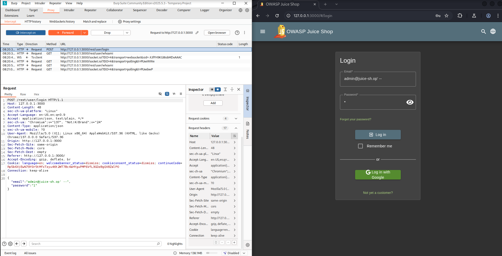
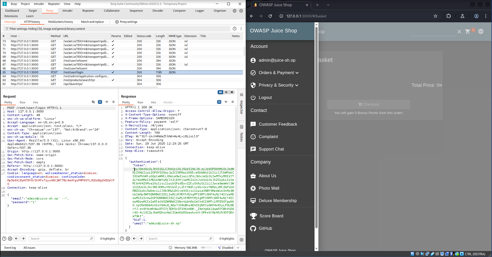
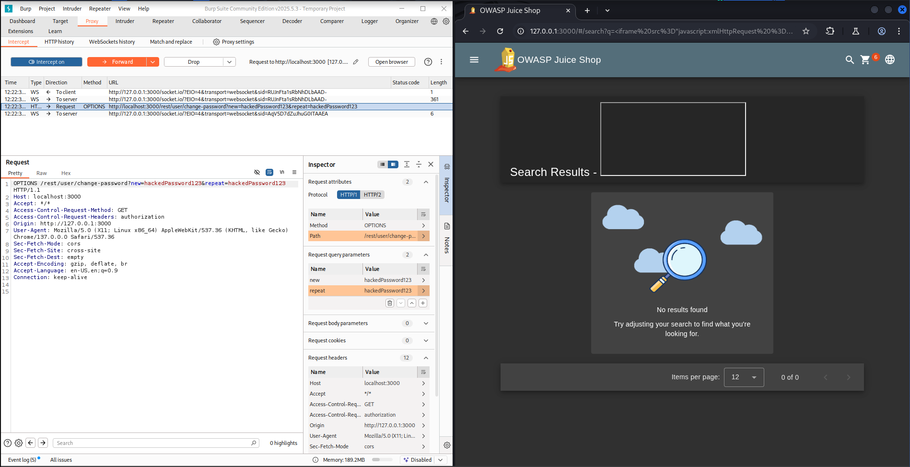
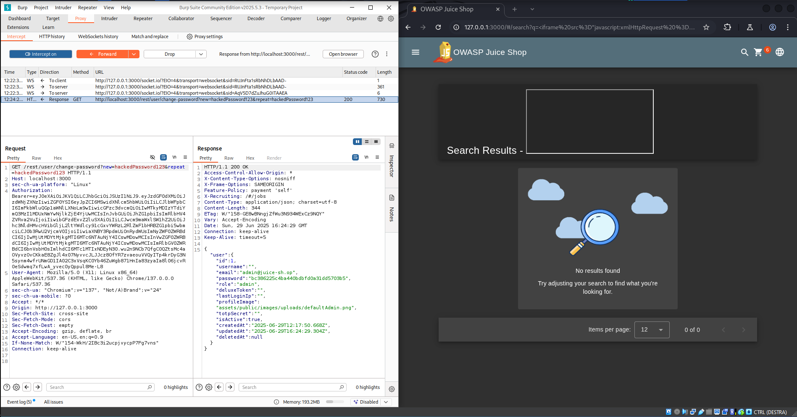
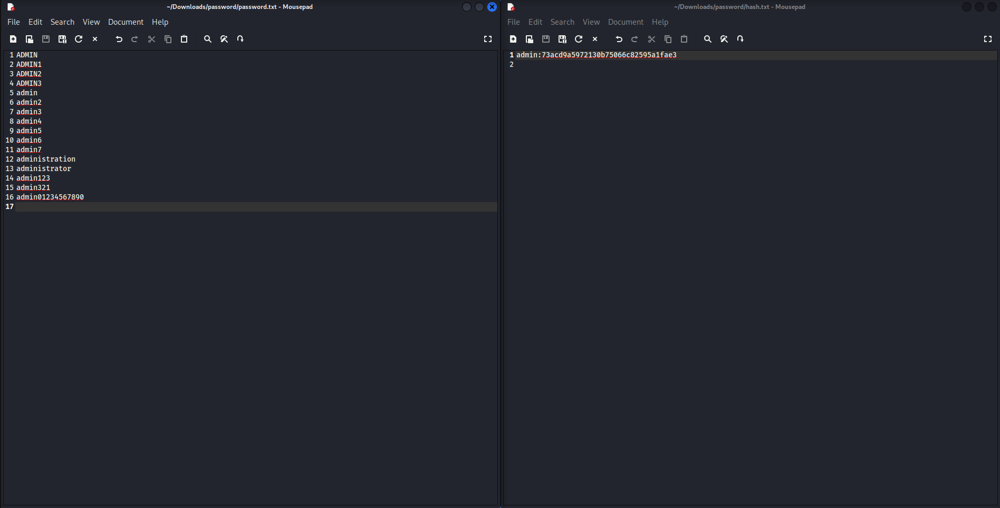
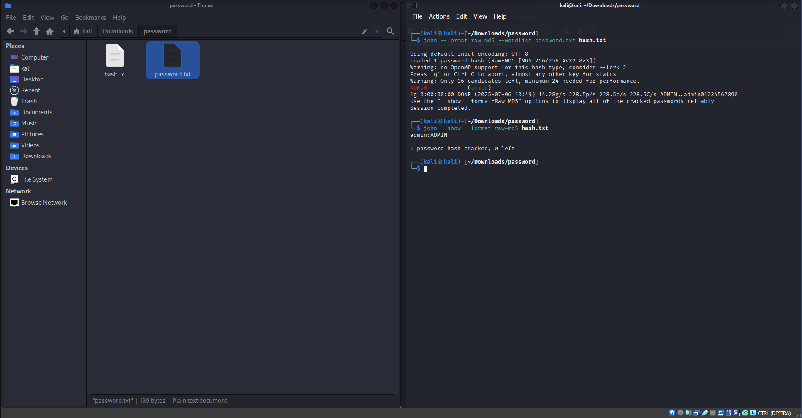

# 1. SQL injection
## Introduzione
Durante la fase di information gathering, è stata individuata la possibilità per l'utente di inviare input arbitrari tramite la pagina di `login`. Gli input utente vengono trasmessi al server backend.

L'analisi del comportamento del backend ha rivelato che il server, al momento del login, costruisce dinamicamente una query SQL tramite concatenazione diretta dei parametri `email` e `password` forniti dall'utente. Questo comportamento introduce una potenziale vulnerabilità di SQL Injection. In questo caso, l'assenza di `prepared statements` o `escaped input` rende la query suscettibile a manipolazione da parte di un attaccante.

Sfruttando la vulnerabilità e l'assenza di controlli, un attaccante può costruire un payload malevolo per bypassare la verifica della password ed effettuare il login su un account esistente (tipicamente l'amministratore), conoscendone solo l'`indirizzo email`.

## Riproducibilità
1. Andare nella pagina di login del sito.
2. Nel campo `email` usare una delle email trovate tramite le review dei prodotto durante l'information gathering. Un email di esempio è: `admin@juice-sh.op`.
3. Nel campo email quindi scrivere l'email di admin oppure un email di un utente a scelta seguito da 2 trattini:
```sql
admin@juice-sh.op' --
```
4. Questo codice esegue una query SQL concatenata che permette di ignorare tutto il codice SQL che c'è dopo `--`:
```sql
SELECT * FROM users WHERE email = 'admin@juice-sh.op' -- AND PASSWORD = '' AND deletedAt IS NULL
```
Tutto il codice dopo `--` quindi `AND PASSWORD ...` viene ignorato. Controlla solo se l'email è valido.

5. Il campo password può essere riempito con una qualsiasi password. 
5. Dopo aver eseguito il login, il server restituisce l'accesso all'account da admin.
6. Si può ripetere tutte queste operazioni per tutti gli altri utenti registrati.

## Prova dell'attacco




# 2. XSS Injection
## Introduzione
### 1. Endpoint di cambio password non autenticato
L'applicazione espone un endpoint per il cambio password attraverso la seguente richiesta GET:

`GET /rest/user/change-password?current=oldPass&new=newPass&repeat=newPass`

- Il parametro `current` (password attuale) **non è obbligatorio**: è possibile inviare la richiesta omettendo tale parametro.
- Il server **non esegue alcun controllo server-side** sull'effettiva validità o presenza della password attuale.
- Questo comporta che un attaccante autenticato (o con sessione valida) potrebbe modificare arbitrariamente la propria password (o potenzialmente quella di altri utenti, in presenza di ulteriori vulnerabilità).

### 2. Input non sanitizzato nella funzionalità di ricerca
La funzionalità di ricerca accetta input utente non filtrato, ed è stato rilevato tramite VA (Vulnerability Assessment) che è vulnerabile ad **attacchi di tipo Cross-Site Scripting (XSS)**.

- L’input inserito nel campo di ricerca viene riflesso nella risposta HTML senza opportune misure di escaping o sanitizzazione.
- È possibile iniettare ed eseguire codice JavaScript arbitrario lato client.

**Esempio di payload XSS**
```html
<iframe src="javascript:xmlHttpRequest = new XMLHttpRequest();
   xmlHttpRequest.open('GET', 'http://localhost:3000/rest/user/change-password?
   new=hackedPassword123&amp;repeat=hackedPassword123');
   xmlHttpRequest.setRequestHeader('Authorization',
   `Bearer=${localStorage.getItem('token')}`);
   xmlHttpRequest.send();"></iframe>
```

Questo frame contenente del codice Javascript malevole, viene eseguito andando a creare una XMLHttpRequest che permette di effettuare richieste al server autenticate usando il token utente valido che è stato memorizzato nel browser.

In particolare, è possibile creare un link malevolo da inviare al cliente che, se venisse aperto, porterebbe l'utente a modificare la propria password in modo inconsapevole. Si è scoperto che la modifica della password, inoltre, non restituisce nessun messaggio effettivo dal server che l'utente normale sia in grado di osservare e che la sessione corrente dell'utente rimane valida anche dopo la modifica della password.

**Esempio di link malevolo**
```html
http://127.0.0.1:3000/#/search?q=%3Ciframe%20src%3D%22javascript:xmlHttpRequest%20%3D%20new%20XMLHttpRequest();
%20%20%20%20xmlHttpRequest.open
('GET',%20'http:%2F%2Flocalhost:3000%2Frest%2Fuser%2Fchange-password%3Fnew%3DhackedPassword123%26amp;repeat%3DhackedPassword123');
%20%20%20%20xmlHttpRequest.setRequestHeader('Authorization',
%60Bearer%3D$%7BlocalStorage.getItem('token')%7D%60);
%20%20%20%20xmlHttpRequest.send();%22%3E%3C%2Fiframe%3E
```

## Riproducibilità
1. Inviare il link mavevolo all'utente da attaccare cercando di invogliarlo a spingere il link.
2. L'utente esegue il link malevolo ma non si accorge che la sua password è stata modificata.
3. Eseguire l'accesso con la email dell'utente e la sua password.

## Prova dell'attacco




# 3. Hash delle password con algoritmo vulnerabile
## Introduzione
Dall'information gathering si è scoperto che il server manda al client durante il logout alcune informazioni riguardante l'utente stesso e, tra le altre cose, l'hash della password utente.

Queste informazioni sono state usate nella fase di vulnerability assessment è stato scoperto che l'hash della password usava MD5 come algoritmo di hashing, il che lo rende vulnerabile ad attacchi di pre-immagine e collisione, e inoltre, è stato rilevato che l'algoritmo non utilizza un salt per proteggere le password, il che significa che due utenti con la stessa password generano lo stesso hash. Questo lo rende particolarmente vulnerabile ad attacchi di tipo brute-force e rainbow table, vulnerabilità ulteriormente aggravata dalla rapidità computazionale di MD5.

## Riproducibilità
1. Eseguire l'accesso con l'account di interesse.
2. Eseguire il logout con l'account di interesse, usando Burp suite oppure qualsiasi altro tool che permetta di intercettare la risposta del server.
3. Salvarsi l'hash della password che il server manda al client durante la fase di logout.
4. Creare un file `password.txt` in cui inserire la password nel formato:
```sh
nomeAccount:hashPassword
```
5. Creare un file `hash.txt` o scaricare un file contente riga per riga, le password più comuni utilizzate normalmente, come nell'esempio sottostante.



6. Eseguire il comando:
```sh
john --format=raw-md5 --wordlist=password.txt hash.txt
```
Che eseguirà un attacco brute-force sul file `hash.txt` usando l'algoritmo MD5 tramite il file di password chiamato `password.txt`.

7. Eseguire il comando:
```sh
john --show --format=raw-md5 hash.txt
```
Che mostrerà le password in chiaro insieme al corrispettivo nome utente o email associato.

## Prova dell'attacco
