# **<span style="color: #66FCF1">Information gathering</span>**

## **<span style="color: #98FF98">1. nmap</span>**
### **Comando completo**

```sh
nmap -sV 127.0.0.1 -p 3000  
```
Lo scopo nell'usare `nmap -sV` è per identificare quale servizio (e versione) è attivo sulla porta 3000 del localhost. Il comando analizza la risposta del servizio confrontandola con il database di firme di Nmap quindi scoprire se c’è un’applicazione in ascolto (es. server web) e qual è la sua versione precisa.

### **Risultato della scansione**
Il risultato della scansione eseguita usando nmap.

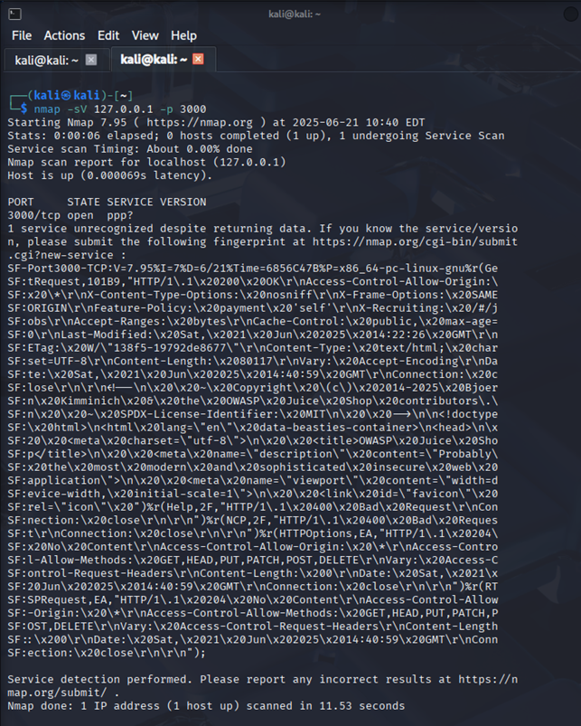

### **Analisi della scansione**
nmap non è stato in grado di identificare correttamente il nome del servizio e la sua versione, probabilmente perchè il container nasconde l'infrastruttura che ci sta dietro.

---

## **2. ffuf**
### **2.1 Comando completo (prima scansione)**

```sh
ffuf -w /usr/share/wordlists/dirb/small.txt -u http://127.0.0.1:3000/FUZZ -t 5
```
Lo scopo nell'uso di ffuf è per trovare directory e file nascosti su un sito web (http://127.0.0.1:3000) tramite brute-forcing. Ogni parola nella wordlist (es. small.txt) sostituisce FUZZ nell’URL. ffuf invia richieste HTTP e analizza le risposte. Il flag -t 5 limita a 5 thread per evitare sovraccarichi o difese anti-bot.

#### **Risultato della scansione**
Il risultato della scansione eseguita usando ffuf.

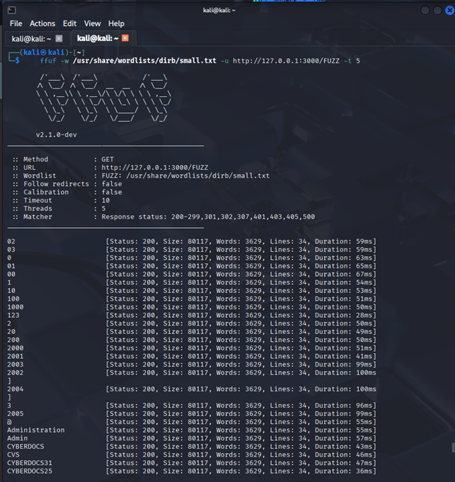

#### **Analisi della scansione**
ffuf è stato in grado di mappare i path del sito web. A quanto pare il sito web gestisce qualsiasi path non presente con status `200` e payload di lunghezza `80117`.

### **2.2 Comando con filtro sulla lunghezza (seconda scansione)**
Per superare il problema precedente, è possibile rieseguire la scansione andando a filtrare gli eventi con questa lunghezza di payload.

```sh
ffuf -w /usr/share/wordlists/dirb/small.txt -u http://127.0.0.1:3000/FUZZ \
-t 5 -fs 80117
```
#### **Spiegazione**
Il flag `-fs 80117` esclude dalla visualizzazione tutti i risultati con una lunghezza di contenuto di 80117 byte, mostrando solo i percorsi che generano una risposta di lunghezza diversa, che presumibilmente sono quelli validi.

#### **Scansione con wordlist più grande**
La prima scansione ha avuto l'obiettivo di determinare come venissero gestite le rotte. Questa seconda scansione è stata effettuata in più profondità, usando una wordslist di dimensioni maggiori.

Per non sovraccaricare il server, usando una wordlist più grande (`common.txt`), è stato deciso di dividerla in parti più piccole ed effettuando una scansione in loop con un'attesa di qualche secondo tra una scansione e l'altra.

#### **Passi della seconda scansione**
1. Suddivisione del file `common.txt`

```sh
split -l 500 /usr/share/wordlists/dirb/common.txt common_part_
```
Questo comando crea file più piccoli (`common_part_aa`, `common_part_ab`, ecc.), ognuno contenente 500 righe del file originale da 4000 righe.

2. Esecuzione del loop di scansione
Si esegue un loop di scansione usando il comando:

```sh
for wordlist in common_part_*; do
  echo "Testing with $wordlist"

  ffuf -w "$wordlist" -u http://127.0.0.1:3000/FUZZ -t 5 -fs 80117 \ 
  -o "risultati_${wordlist}.json" -of json

  sleep 10
done
```
*   `for wordlist in ...`: Itera su tutti i file creati dallo `split`.
*   `-t 5`: Riduce il numero di thread a 5 per non sovraccaricare il server.
*   `-o "..." -of json`: Salva i risultati di ogni scansione in un file JSON separato.
*   `sleep 10`: Introduce una pausa di 10 secondi tra una scansione e l'altra per evitare troppo scansioni di fila.

3. Riepilogo dei risultato
Si usare jq per creare un report finale di tutti i singoli risultati:

```sh
jq -r '.results[] | "\(.input) -> \(.status) [\(.length) bytes]"' \ 
risultati_*.json > riepilogo.txt
```

#### **Risultato della scansione**
Il risultato della scansione eseguita usando ffuf.

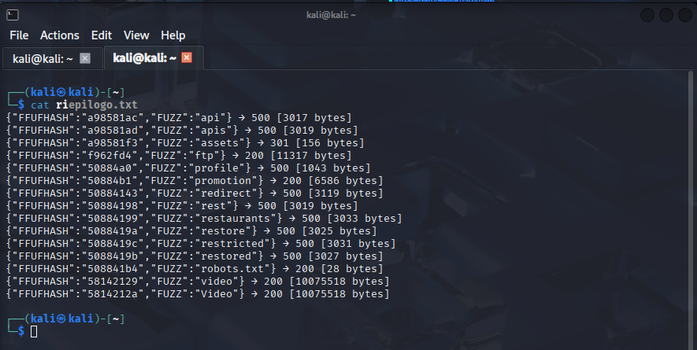

#### **Analisi della scansione**
La seconda analisi più approfondità ha permesso di determinare la presenza di path interessanti come ad esempio `ftp`.

### **2.3 Scansione con un altra wordlist (terza scansione)**
Si esegue una terza scansione, questa volta con una wordlist più ampia fornita da `dirbuster` seguendo le stesse operazioni precedenti.

```sh
split -l 500 /usr/share/wordlists/dirbuster/directory-list-2.3-medium.txt \ 
dirbuster_common_part_

for wordlist in dirbuster_common_part_*; do
  echo "Testing with $wordlist"

  ffuf -w "$wordlist" -u http://127.0.0.1:3000/FUZZ -t 5 -fs 80117 \ 
  -o "risultati_${wordlist}.json" -of json

  sleep 5
done

jq -r '.results[] | "\(.input) -> \(.status) [\(.length) bytes]"' \ 
risultati_*.json > riepilogo.txt
```

#### **Risultato della scansione**
Il risultato della scansione eseguita usando ffuf.

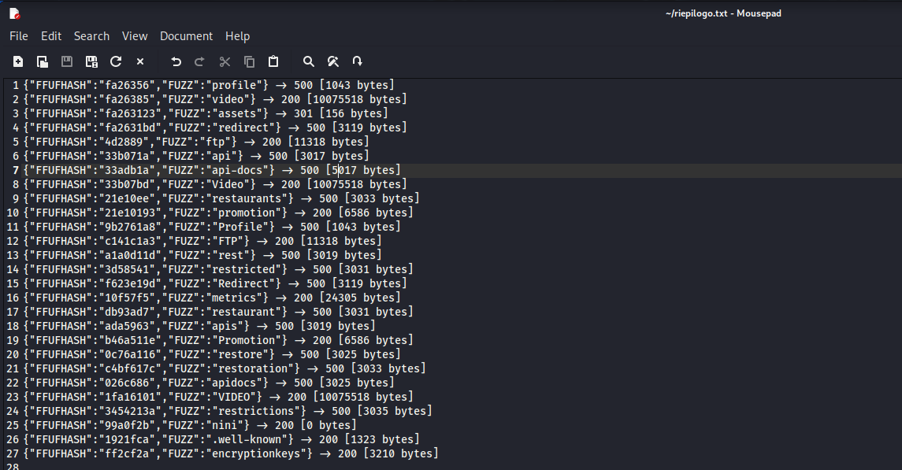

#### **Analisi della scansione**
La seconda ricerca ha permesso di trovare ulteriori path che non erano stati scoperti prima, in particolare possono essere path di interesse: `api-docs`, `.well-known` ed `encryptionkeys`.

---

## **3. Burp**
### Spiegazione
Lo scopo di Burp è per analizzare il traffico tra browser e server e identificare vulnerabilità nel sito web. Intercetta le richieste HTTP/HTTPS, mappa automaticamente la struttura del sito e permette modifiche in tempo reale alle richieste, con l'obiettivo finale di: scoprire risorse, endpoint, parametri e testare difese contro attacchi come SQL injection e XSS in un ambiente sicuro e controllato.

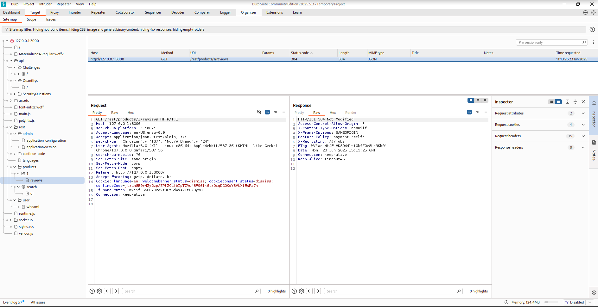

---

## **3. Ricerca manuale sul sito web**
### **3.1 About**
Dentro about c'è un link che rimanda alla pagina `legal.md` che si trova dentro la cartella `ftp`. Questo è un altro modo per raggiungere ftp.

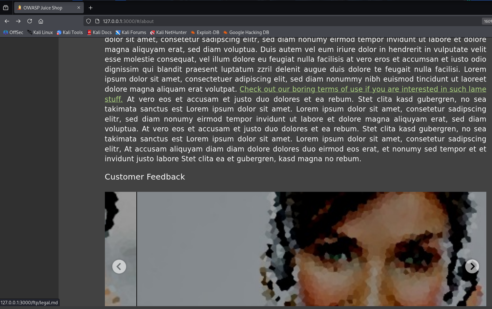

### **3.2 User enumeration**
Cercando tra i prodotti è stato possibile capire quali sono gli utenti, possibilmente i ruoli collegati per poter effettuare successivamente attacchi mirati. 

In questo caso questo utente con admin nella sua email potrebbe essere un admin del sito.

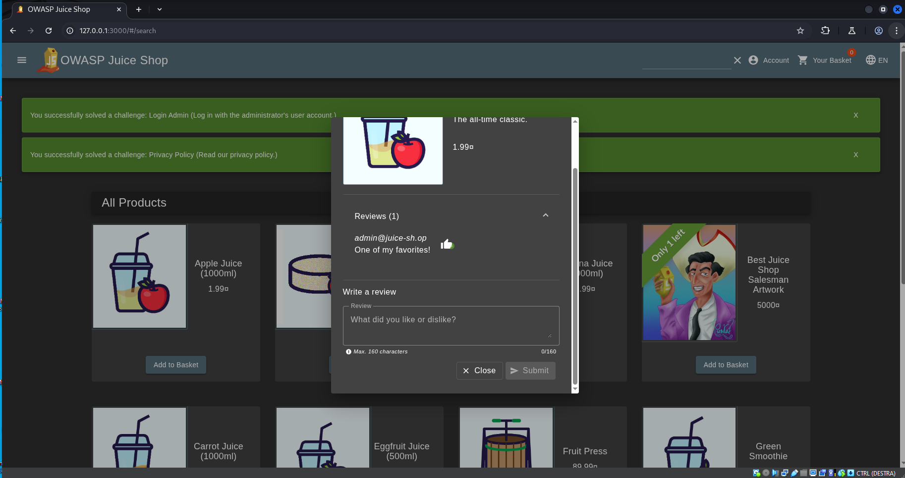

### **3.3 Architecture enumeration**
Dal menu a tendina, è possibile conoscere gli stack tecnologici usati dal sito web tra cui troviamo:

  - Angular
  - HTML5
  - SASS
  - CSS3
  - Javascript
  - Node.js
  - DB SQL
  - Mongo DB

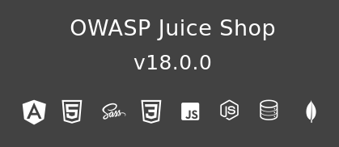

### **3.4 Path enumeration**
Andando a leggere il file javascript `main.js` è possibile scoprire eventuali nuove rotte non scoperte prima.

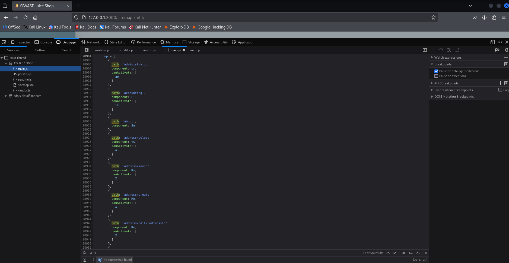

### **3.5 Input**
Il sito web presenta diverse punti nel quale è possibile inserire degli input utente.

**Search**: esempio di search con la possibilità di eseguire una ricerca.

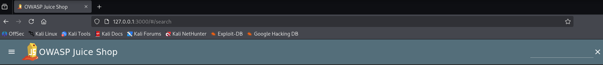

**Login**: essempio di login/registration con la possibilità di mandare sicuramente dati al server.

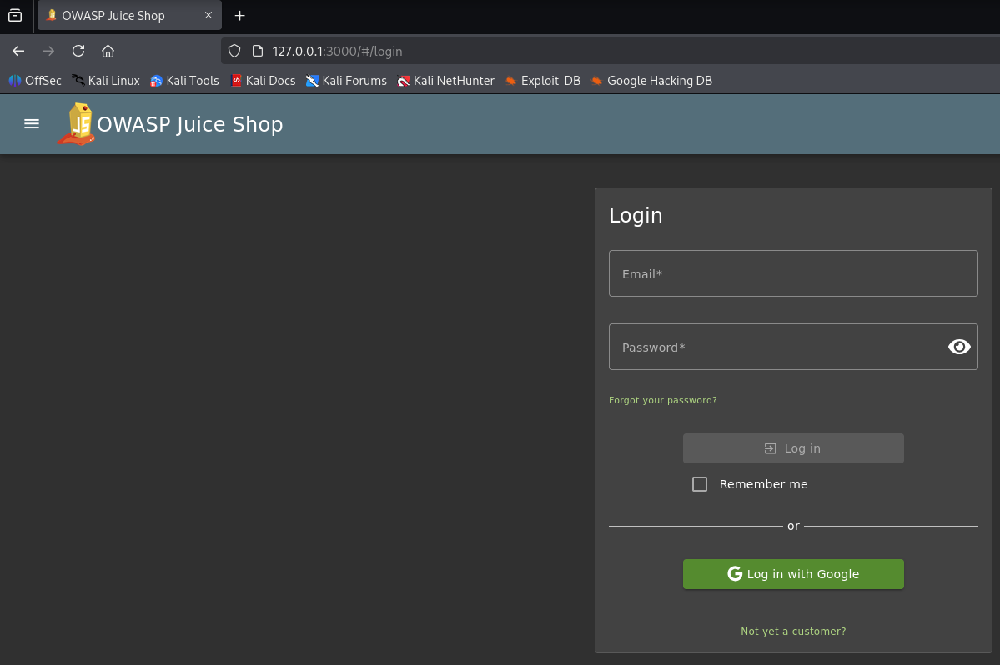

### **3.6 File**
Nel file main.js sono state trovate delle credenziali hard-coded.

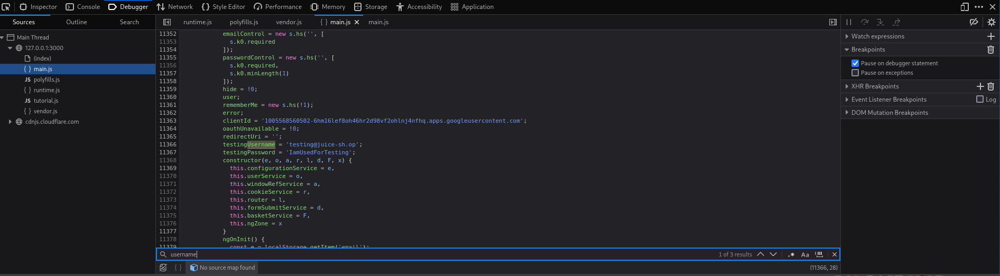

---

## **4. Ricerca di informazioni dopo autenticazione**

### **4.1 Informazioni di login**
Si può ottenere informazioni di login, sopratutto dati riguardanti i dati contenuti dentro il DB.

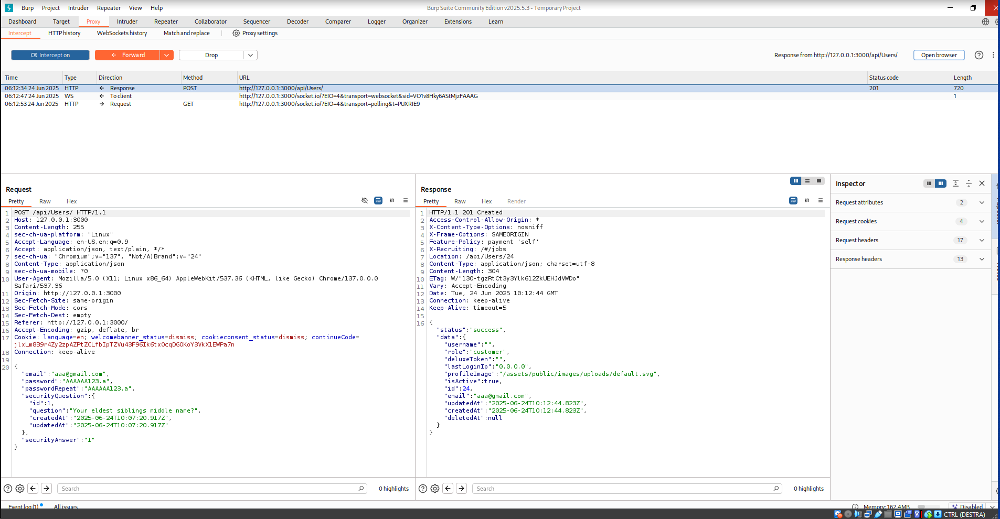

### **4.2 Review**
La pagina di review contiene un input che potrebbe essere manipolato.

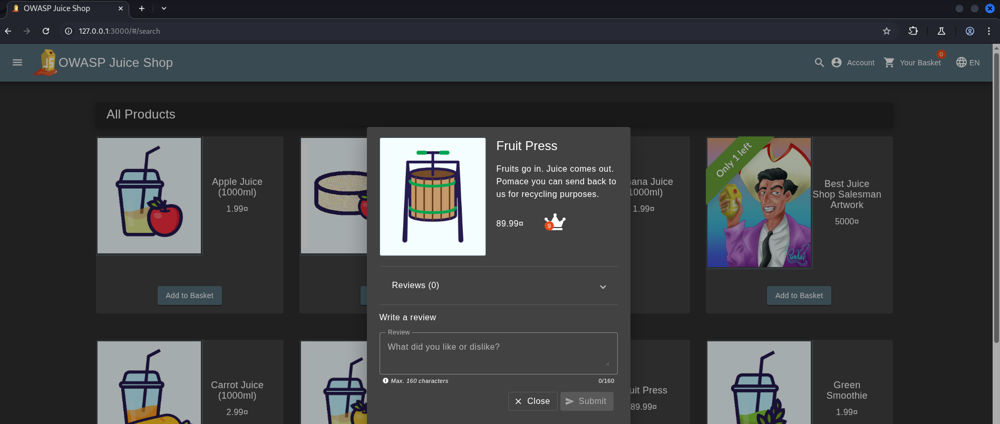

### **4.3 Pagina di feedback**
Anche la pagina di feedback contiene un input che potrebbe essere manipolabile.

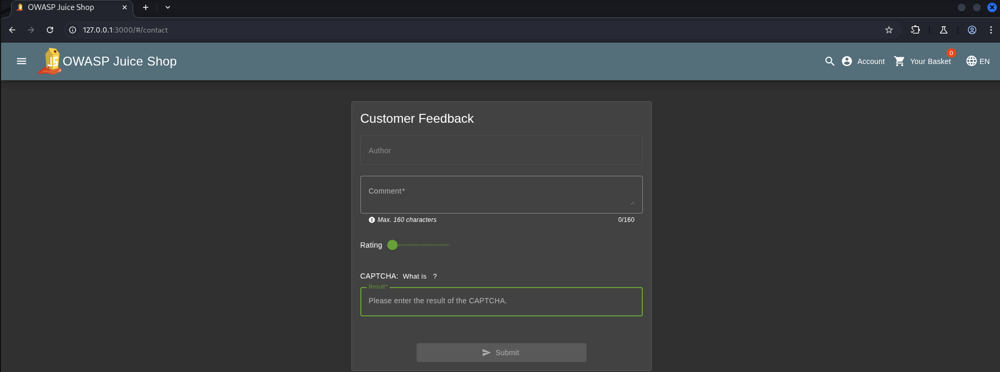

### **4.4 Chatbot**
Molti similmente, anche la pagina del chatbot contiene un input utente che potrebbe essere manipolato.

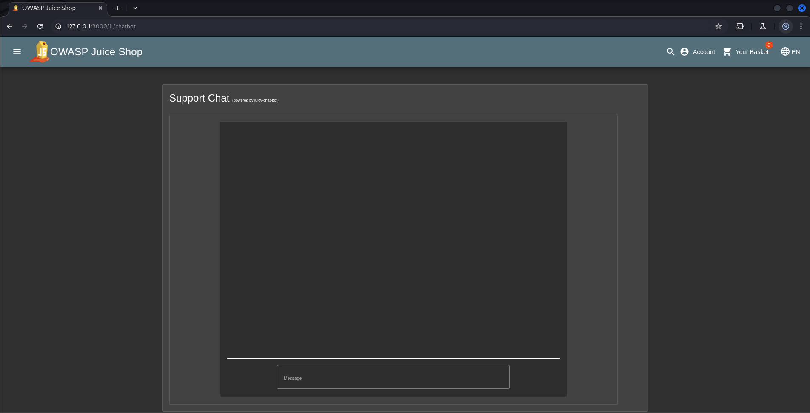

### **4.5 Complaint**
Similmente, anche la pagina di complaint rappresenta un altro possibile vettore d'attacco.

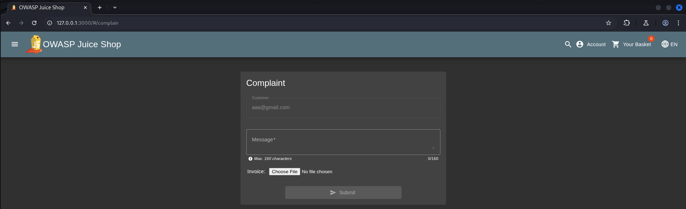

### **4.6 Basket**
Quando si richiede i prodotti inseriti nel carrello, il server invia una richiesta GET usando il basket id dell'utente.

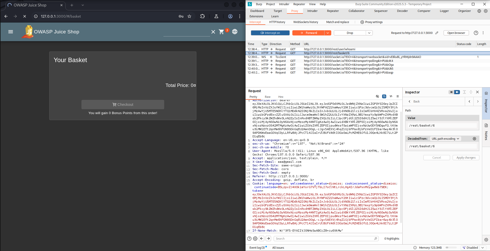

### **4.7 Login information**
Dopo il logout, il server invia questi dati personali dell'utente riguardante l'autenticazione al server, tra cui la password hashata.

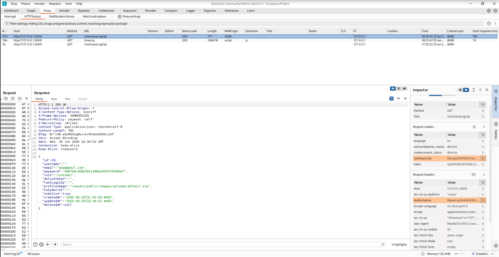

---

## **5. Analisi dei path trovati**
### **Introduzione**
Le pagine trovate precedententemente sono di 3 tipi 500, 200 e 301. Essi rappresentano:

  1. **200**: pagine visitabili
  2. **301**: pagine che reindirizzano ad altre pagine
  3. **500**: pagine non visitabili direttamente come la api che probabilmente richiede dei parametri aggiuntivi.

### **5.1 Cartella FTP**
La `cartella ftp` contiene una serie di file sensibili o che dovrebbero essere protetti da accessi indesiderati.

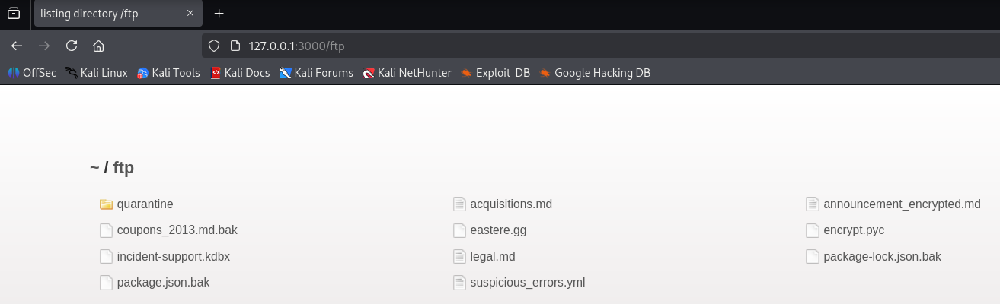

Un esempio di file è `acquisition.md` che come è stat dichiarato nel file stesso, contiene informazioni confidenziale.

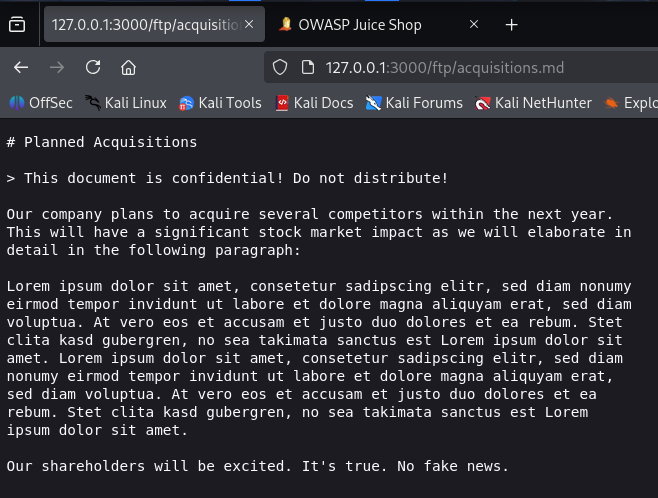

#### **File accessibili**
Sembra che tutti i file siano accessibili pubblicamente ma solo i file `.md` e `.pdf` vengono restituiti dal server. Forse è possibile aggirare in qualche modo, magari modificando la richiesta verso il server.

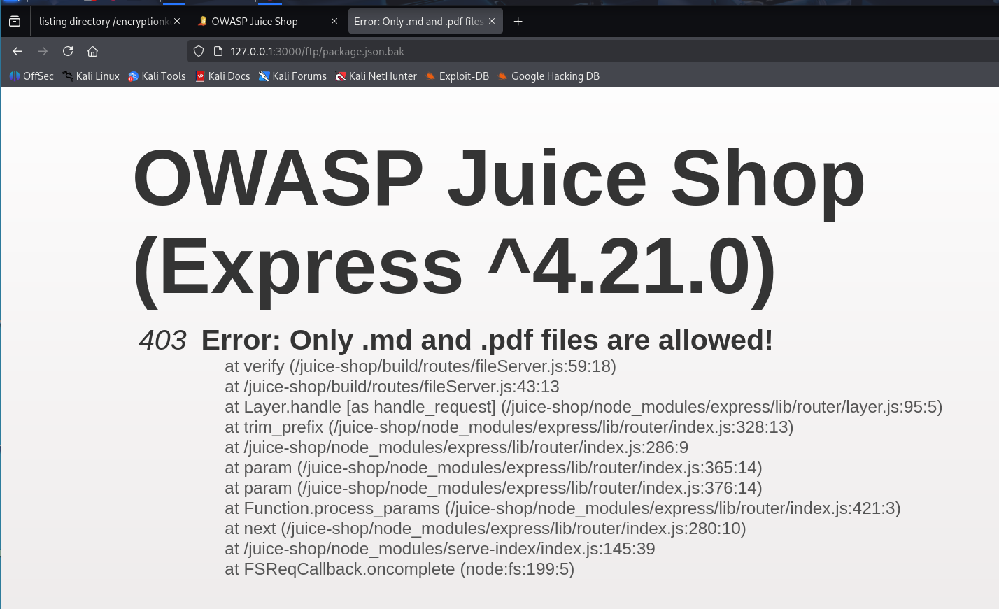

### **5.2 Cartella metrics**
La cartella metrics sembra contenere delle informazioni riguardanti le metriche che vengono raccolte dal sito. Sono probabilemente informazioni che dovrebbero rimanere protette.

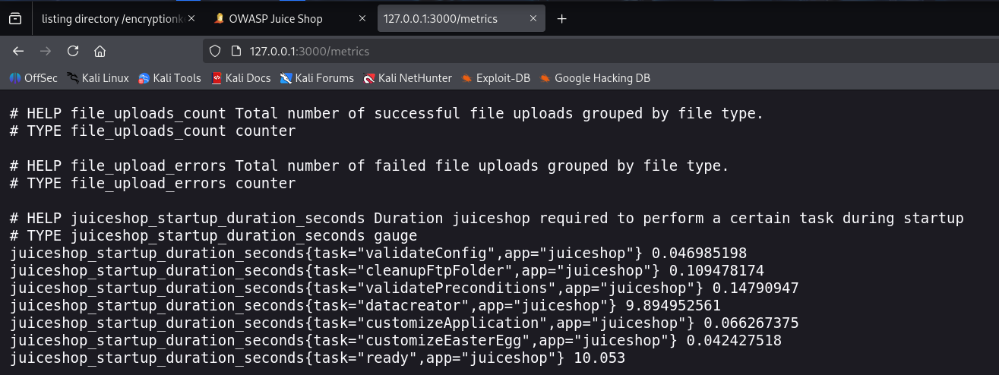

### **5.3 Cartella api-docs**
Sembra che sia una pagina di documentazione di una API usata, in particolare per gestire gli ordini.

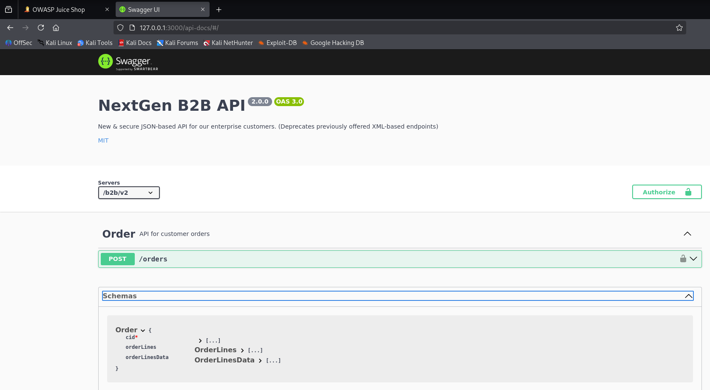

### **5.4 API e REST**
Sia API sia REST sono usati per chiamate API al server. 

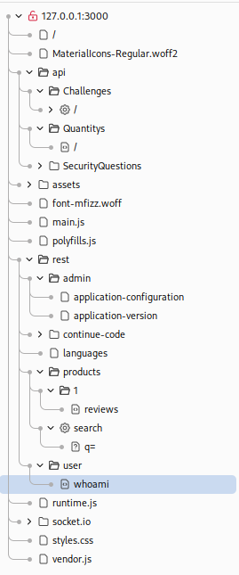

### **5.5 Cartella .well-known**
Sembra contenere informazioni di contatto in fatto di sicurezza e vulnerabilità passate trovate nel sito web.

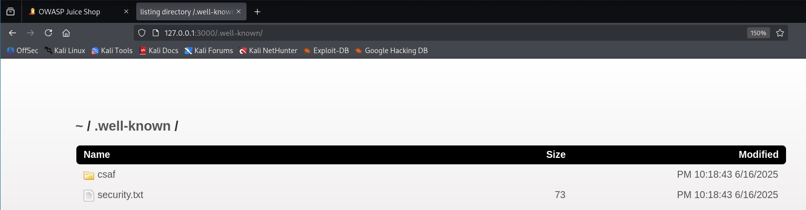

### **5.6 Cartella encryptionkey**
Questa cartella sembra contenere 2 tipi di chiave:

  - jwt.pub: potrebbe essere collegato a jwt usando per creare, leggere, modificare i token d'accesso.
  - premium.key: una qualche chiave per accedere a servizi premium di qualche tipo.

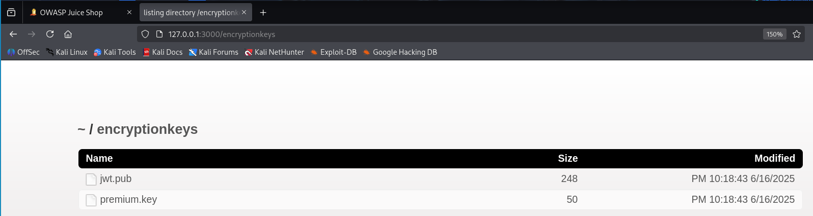

### **5.7 Robots.txt**
Il file robots.txt rappresenta un file usato dai siti web per regolare i crawler ovvero script automatici di scansione delle pagine web. Può essere utile per conoscere path nascosti. 

In questo caso l'unica informazione datà è la presenza della cartllea ftp di cui si conosceva già la presenza.

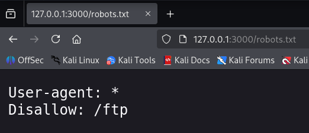

---

## **<span style="color: #201196">6. whois</span>**
### **Comando completo**

```sh
whois owasp-juice.shop  
```

Lo scopo di usare whois è per raccogliere informazioni di registrazione su un dominio web.  Interroga i database WHOIS pubblici per ottenere dati come registrar, date di creazione/scadenza, nameserver e contatti amministrativi con l'obiettivo finale di ottenere una panoramica iniziale dell’infrastruttura del dominio.

### **Risultato della scansione**
Il risultato della scansione eseguita usando whois.

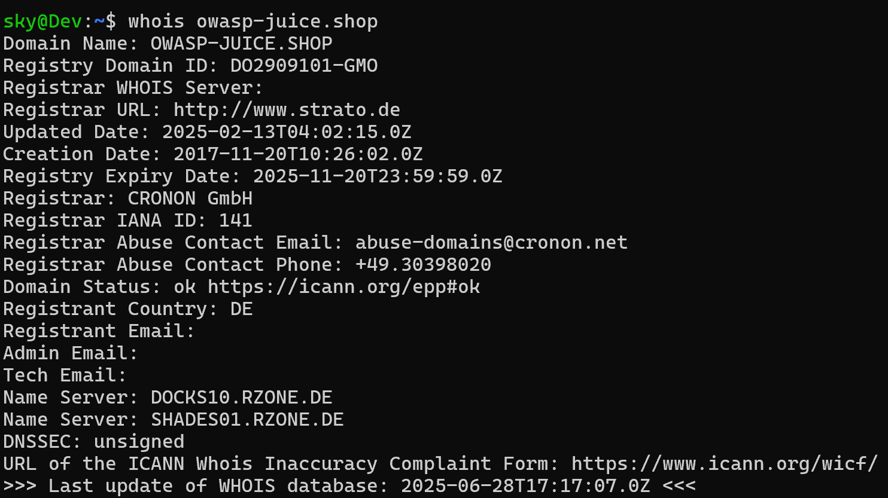

### **Analisi della scansione**
Il dominio `owasp-juice.shop` è regolarmente registrato dal 2017 e ha una data di scadenza nel novembre 2025, il che conferma che si tratta di un progetto attivamente mantenuto. Il dominio è stato registrato presso il registrar `CRONON GmbH` (IANA ID 141), con sede in Germania. I server DNS associati sono `docks10.rzone.de` e `shades01.rzone.de`.
Non sono presenti informazioni pubbliche su email o dettagli amministrativi (i campi sono omessi o oscurati), il che è normale per motivi di privacy o per il tipo di dominio. Il dominio ha uno stato “ok”, il che indica che non ci sono restrizioni particolari (es. blocchi, sospensioni, trasferimenti in corso).

---

## 7. dnsrecon
### **Comando completo**

```sh
dnsrecon -d owasp-juice.shop -t std  
```
Si usa il comando dnsrecon -t std per effettuare una ricognizione DNS completa sul dominio target. Interroga i DNS per raccogliere record chiave come A, AAAA, NS, MX, SRV, DMARC e DKIM. L'obiettivo finale è ottenere una mappa dell’infrastruttura DNS e dei servizi associati al dominio.

### **Risultato della scansione**
Il risultato della scansione eseguita usando dnsrecon.


### **Analisi della scansione**
_DNSSEC non configurato_, potenziale vulnerabilità se l'integrità dei record DNS è importante. _SOA/NS/MX_, rivela provider DNS e di posta, utili per ricostruire l'infrastruttura. _Record A e AAAA_, forniscono IP pubblici. _Record TXT (DMARC/DKIM)_, utili per valutare la protezione da spoofing (manca SPF e DKIM è solo parzialmente attivo). _Record SRV_, indica un endpoint autodiscover che può essere testato per vulnerabilità, ad esempio in contesti Exchange o Outlook autodiscover leaks.

---

## 8. whatweb
### **Comando completo**

```sh
whatweb http://127.0.0.1:3000  
```
Si usa whatweb per identificare tecnologie web e configurazioni attive su un sito target Analizza la risposta HTTP di un sito per rilevare framework, CMS, librerie JS, versioni software e intestazioni particolari. Viene quindi usato per scoprire potenziali vulnerabilità note o debolezze di configurazione attraverso il fingerprinting delle tecnologie usate.

### **Risultato della scansione**
Il risultato della scansione eseguita usando whatweb.

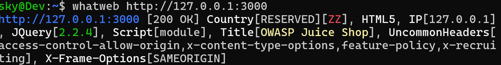

### **Analisi della scansione**
_Tecnologie rilevate:_ HTML5, JQuery 2.2.4 (libreria JS ampiamente diffusa ma in versione obsoleta), Script[module] (suggerisce l'uso di JavaScript moderno con moduli ES6). _Header HTTP rilevanti:_ access-control-allow-origin: *: consente richieste cross-origin da qualsiasi dominio. Potrebbe indicare una potenziale debolezza di sicurezza (CORS misconfiguration) se associata a endpoint sensibili; x-content-type-options: nosniff, x-frame-options: SAMEORIGIN: header utili per la protezione contro alcuni attacchi (es. MIME sniffing, clickjacking); feature-policy, x-recruiting: headers non standard o personalizzati, probabilmente legati al deployment dell'app.

### **8.1 Modalità verbosa**
### **Comando completo**

```sh
whatweb -v http://127.0.0.1:3000
```

### **Spiegazione**
*   **Informazioni aggiuntive:** _Feature-Policy: payment 'self'_ → restrizione funzioni browser; _X-Recruiting: /#/jobs_ → potenziale endpoint interno/nascosto; _Cache-Control, ETag, Content-Encoding, Content-Type_ → info di caching e compressione.

*   **Considerazioni:** L’header `X-Recruiting` suggerisce un collegamento a un endpoint `/#/jobs` non immediatamente visibile dalla homepage. Potrebbe essere utile nella fase Exploit, ad esempio per ottenere accesso a funzionalità amministrative, backdoor o account interni di test. L’uso di `Access-Control-Allow-Origin: *` mostra una configurazione CORS permissiva, potenzialmente sfruttabile in scenari di attacco CSRF o di esfiltrazione da domini non autorizzati.


### **Risultato**
Il risultato della scansione eseguita usando whatweb.

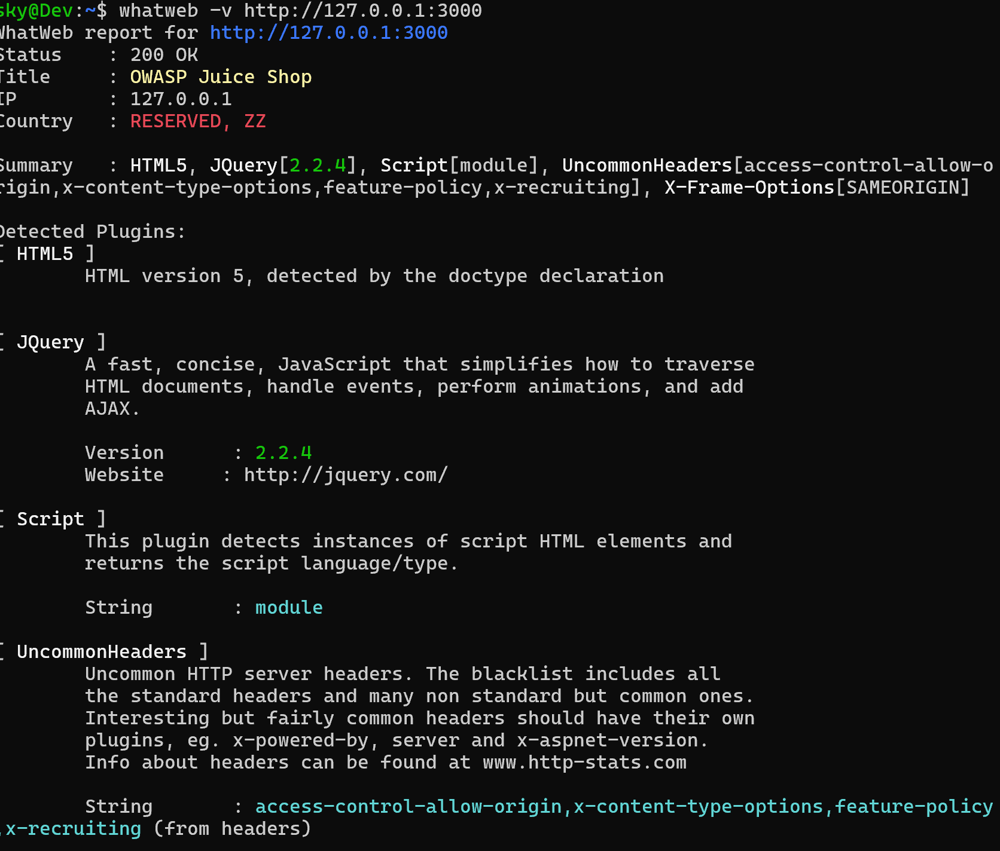

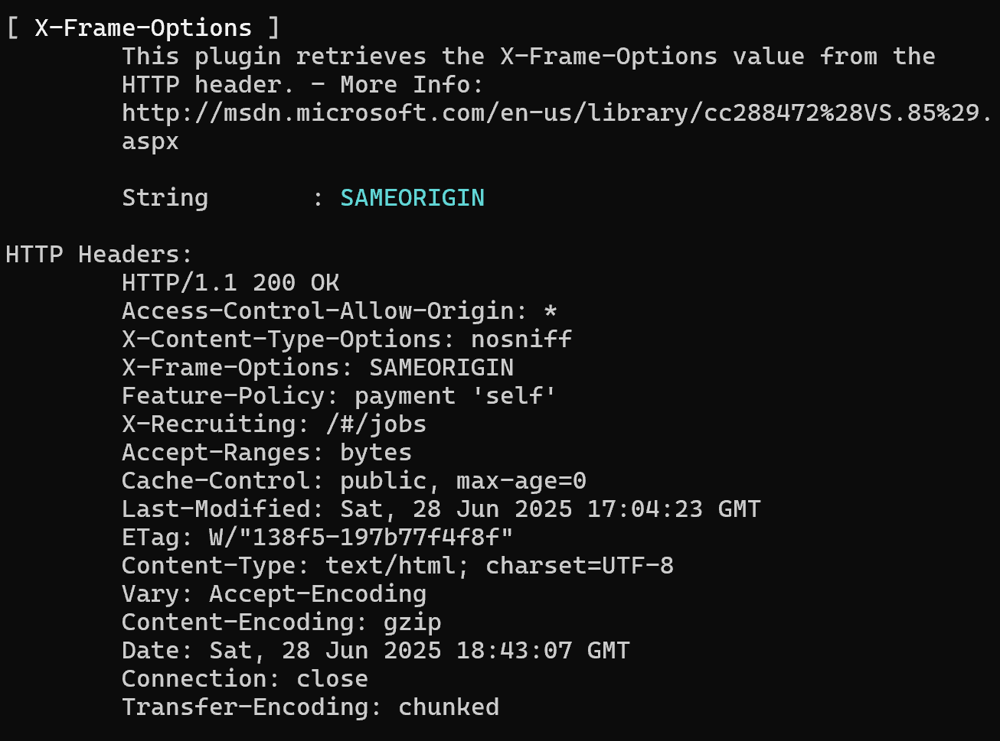

---