# <span style="color: #66FCF1">Information gathering</span>

## **<span style="color: #98FF98">1. nmap</span>**
### **Comando completo**

```sh
nmap -sV 127.0.0.1 -p 3000
```

### **Spiegazione**
*   **Motivo dell'utilizzo:** Identificare il servizio e la sua versione in ascolto sulla porta specificata.

*   **Obiettivo della scansione:** Determinare quale applicazione (es. server web) e la sua versione è in esecuzione sulla porta 3000 del server locale (127.0.0.1). Sarebbe ovviamente possibile, eseguire una mappatura sull'IP e su tutte le porte possibili collegate all'IP stesso.

*   **Spiegazione del funzionamento:** Il comando `nmap` con il flag `-sV` (Service Version detection) invia una richiesta alla porta 3000 per analizzare le risposte del servizio e confrontarle con il suo database di firme, riuscendo così a identificare il tipo di servizio e la sua versione. In questo caso, la scansione è mirata specificamente all'indirizzo localhost e alla porta 3000.

### **Risultato della scansione**


### **Analisi della scansione**
nmap non è stato in grado di identificare correttamente il nome del servizio e la sua versione, probabilmente perchè il container nasconde l'infrastruttura che ci sta dietro.

---

## **2. ffuf**
### **2.1 Comando completo (prima scansione)**

```sh
ffuf -w /usr/share/wordlists/dirb/small.txt -u http://127.0.0.1:3000/FUZZ -t 5
```

#### **Spiegazione**
*   **Motivo dell'utilizzo:** Eseguire un'enumerazione di directory e file (directory brute-forcing) per scoprire risorse nascoste sul server web.

*   **Obiettivo della scansione:** Trovare percorsi web validi (come `/admin`, `/login`, `/css`, ecc.) sul server in esecuzione all'indirizzo `http://127.0.0.1:3000` utilizzando una wordlist fornita dall'utente.

*   **Spiegazione del funzionamento:** `ffuf` prende ogni parola dalla wordlist specificata (in questo caso `small.txt`) e la sostituisce al placeholder `FUZZ` nell'URL. Invia una richiesta HTTP per ogni URL generato e ne analizza la risposta. Il flag `-t 5` imposta il numero di thread a 5 per ridurre il numero di richieste contemporanee per non sovracaricare il server e cercare di ridurre eventuali blocchi anti-bot.

#### **Risultato della scansione**


#### **Analisi della scansione**
ffuf è stato in grado di mappare i path del sito web. A quanto pare il sito web gestisce qualsiasi path non presente con status `200` e payload di lunghezza `80117`.

### **2.2 Comando con filtro sulla lunghezza (seconda scansione)**
Per superare il problema precedente, è possibile rieseguire la scansione andando a filtrare gli eventi con questa lunghezza di payload.

```sh
ffuf -w /usr/share/wordlists/dirb/small.txt -u http://127.0.0.1:3000/FUZZ -t 5 -fs 80117
```
#### **Spiegazione**
Il flag `-fs 80117` esclude dalla visualizzazione tutti i risultati con una lunghezza di contenuto di 80117 byte, mostrando solo i percorsi che generano una risposta di lunghezza diversa, che presumibilmente sono quelli validi.

#### **Scansione con wordlist più grande**
La prima scansione ha avuto l'obiettivo di determinare come venissero gestite le rotte. Questa seconda scansione è stata effettuata in più profondità, usando una wordslist di dimensioni maggiori.

Per non sovraccaricare il server, usando una wordlist più grande (`common.txt`), è stato deciso di dividerla in parti più piccole ed effettuando una scansione in loop con un'attesa di qualche secondo tra una scansione e l'altra.

#### **Passi della seconda scansione**
1. Suddivisione del file `common.txt`

```sh
split -l 500 /usr/share/wordlists/dirb/common.txt common_part_
```
Questo comando crea file più piccoli (`common_part_aa`, `common_part_ab`, ecc.), ognuno contenente 500 righe del file originale da 4000 righe.

2. Esecuzione del loop di scansione
Si esegue un loop di scansione usando il comando:

```sh
for wordlist in common_part_*; do
  echo "Testing with $wordlist"

  ffuf -w "$wordlist" -u http://127.0.0.1:3000/FUZZ -t 5 -fs 80117 -o "risultati_${wordlist}.json" -of json

  sleep 10
done
```
*   `for wordlist in ...`: Itera su tutti i file creati dallo `split`.
*   `-t 5`: Riduce il numero di thread a 5 per non sovraccaricare il server.
*   `-o "..." -of json`: Salva i risultati di ogni scansione in un file JSON separato.
*   `sleep 10`: Introduce una pausa di 10 secondi tra una scansione e l'altra per evitare troppo scansioni di fila.

3. Riepilogo dei risultato
Si usare jq per creare un report finale di tutti i singoli risultati:

```sh
jq -r '.results[] | "\(.input) -> \(.status) [\(.length) bytes]"' risultati_*.json > riepilogo.txt
```

#### **Risultato della scansione**


#### **Analisi della scansione**
La seconda analisi più approfondità ha permesso di determinare la presenza di path interessanti come ad esempio `ftp`.

### **2.3 Scansione con un altra wordlist (terza scansione)**
Si esegue una terza scansione, questa volta con una wordlist più ampia fornita da `dirbuster` seguendo le stesse operazioni precedenti.

```sh
split -l 500 /usr/share/wordlists/dirbuster/directory-list-2.3-medium.txt dirbuster_common_part_

for wordlist in dirbuster_common_part_*; do
  echo "Testing with $wordlist"

  ffuf -w "$wordlist" -u http://127.0.0.1:3000/FUZZ -t 5 -fs 80117 -o "risultati_${wordlist}.json" -of json

  sleep 5
done

jq -r '.results[] | "\(.input) -> \(.status) [\(.length) bytes]"' risultati_*.json > riepilogo.txt
```

#### **Risultato della scansione**


#### **Analisi della scansione**
La seconda ricerca ha permesso di trovare ulteriori path che non erano stati scoperti prima, in particolare possono essere path di interesse: `api-docs`, `.well-known` ed `encryptionkeys`.

---

## **3. Analisi dei path trovati**
### **Introduzione**
Le pagine trovate precedententemente sono di 3 tipi 500, 200 e 301. Essi rappresentano:
1. **200**: pagine visitabili
2. **301**: pagine che reindirizzano ad altre pagine
3. **500**: pagine non visitabili direttamente come la api che probabilmente richiede dei parametri aggiuntivi.

### **3.1 Cartella FTP**
La `cartella ftp` contiene una serie di file sensibili o che dovrebbero essere protetti da accessi indesiderati.

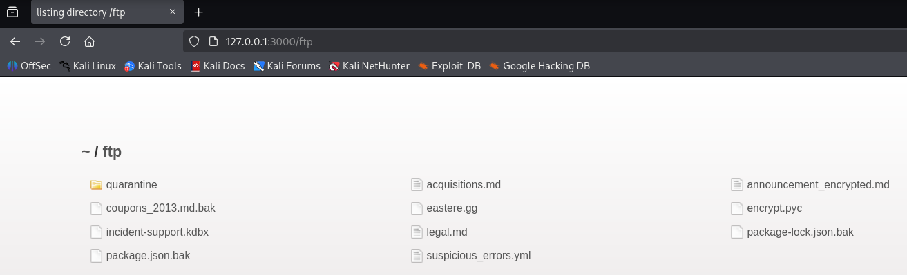

Un esempio di file è `acquisition.md` che come è stat dichiarato nel file stesso, contiene informazioni confidenziale.

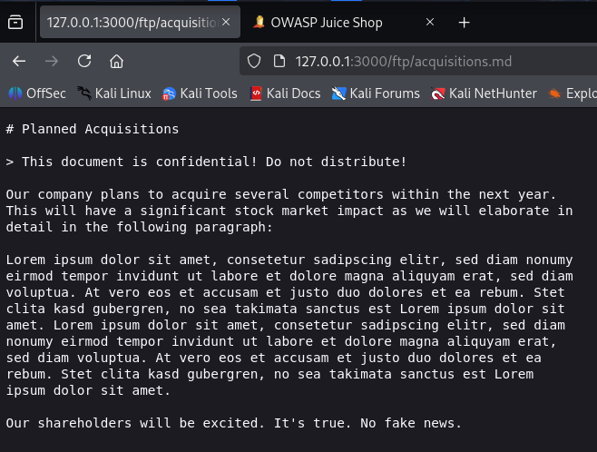

#### **File accessibili**
Sembra che tutti i file siano accessibili pubblicamente ma solo i file `.md` e `.pdf` vengono restituiti dal server. Forse è possibile aggirare in qualche modo, magari modificando la richiesta verso il server.

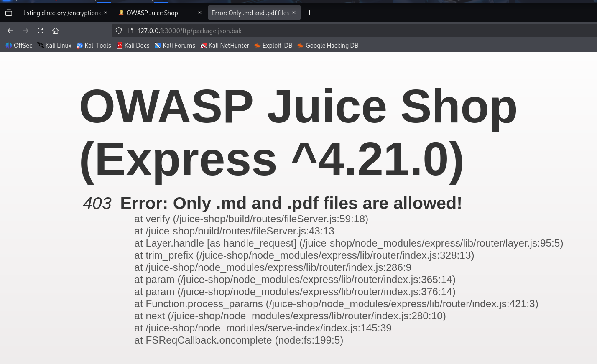

### **3.2 Cartella metrics**
La cartella metrics sembra contenere delle informazioni riguardanti le metriche che vengono raccolte dal sito. Sono probabilemente informazioni che dovrebbero rimanere protette.


### **3.3 Cartella api-docs**
Sembra che sia una pagina di documentazione di una API usata, in particolare per gestire gli ordini.

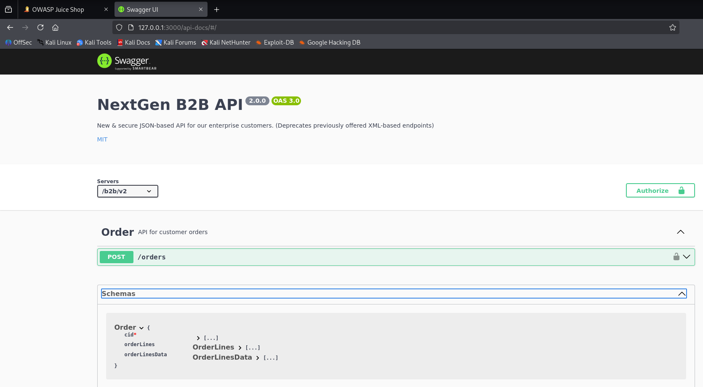

### **3.4 Cartella .well-known**
Sembra contenere informazioni di contatto in fatto di sicurezza e vulnerabilità passate trovate nel sito web.

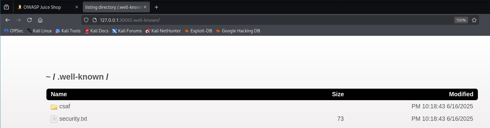

### **3.5 Cartella encryptionkey**
Questa cartella sembra contenere 2 tipi di chiave:
- jwt.pub: potrebbe essere collegato a jwt usando per creare, leggere, modificare i token d'accesso.
- premium.key: una qualche chiave per accedere a servizi premium di qualche tipo.

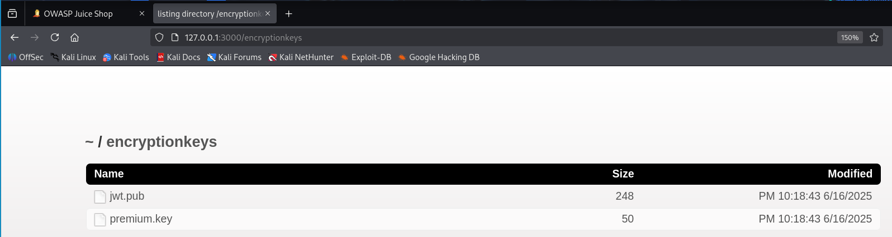

### **3.6 Robots.txt**
Il file robots.txt rappresenta un file usato dai siti web per regolare i crawler ovvero script automatici di scansione delle pagine web. Può essere utile per conoscere path nascosti. 

In questo caso l'unica informazione datà è la presenza della cartllea ftp di cui si conosceva già la presenza.

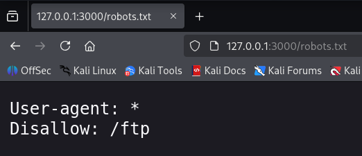

---

## **4. Ricerca manuale sul sito web**
### **4.1 About**
Dentro about c'è un link che rimanda alla pagina `legal.md` che si trova dentro la cartella `ftp`. Questo è un altro modo per raggiungere ftp.

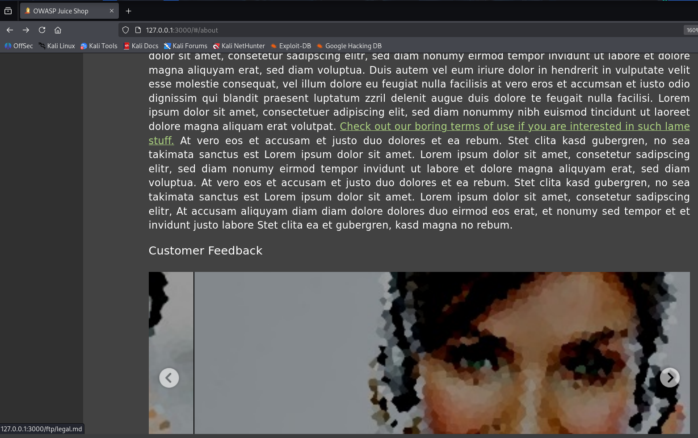

### **4.2 User enumeration**
Cercando tra i prodotti è stato possibile capire quali sono gli utenti, possibilmente i ruoli collegati per poter effettuare successivamente attacchi mirati. 

In questo caso questo utente con admin nella sua email potrebbe essere un admin del sito.

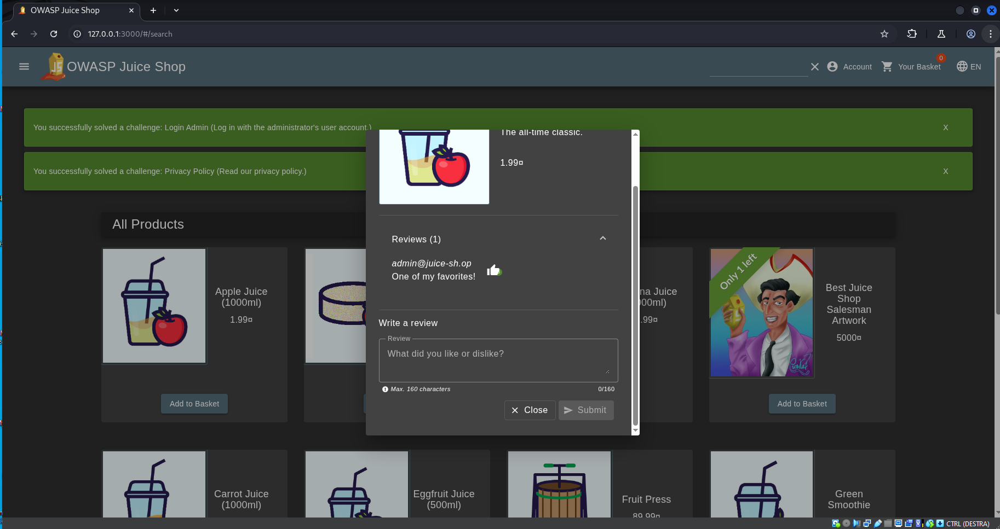

### **4.3 architecture enumeration**
Dal menu a tendina, è possibile conoscere gli stack tecnologici usati dall sito web tra cui troviamo:
- Angular
- HTML5
- SASS
- CSS3
- Javascript
- Node.js
- DB SQL
- Mongo DB

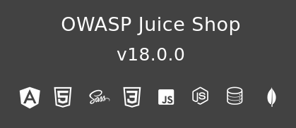

### **4.3 Path enumeration**
Andando a leggere il file javascript `main.js` è possibile scoprire eventuali nuove rotte non scoperte prima.

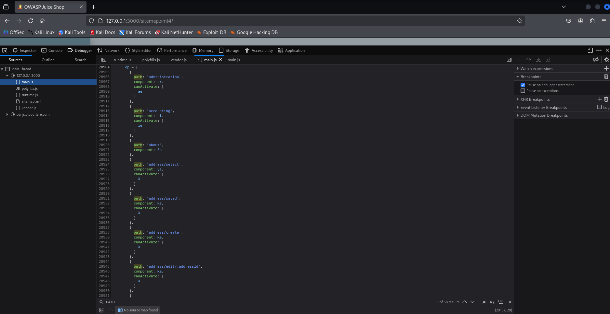