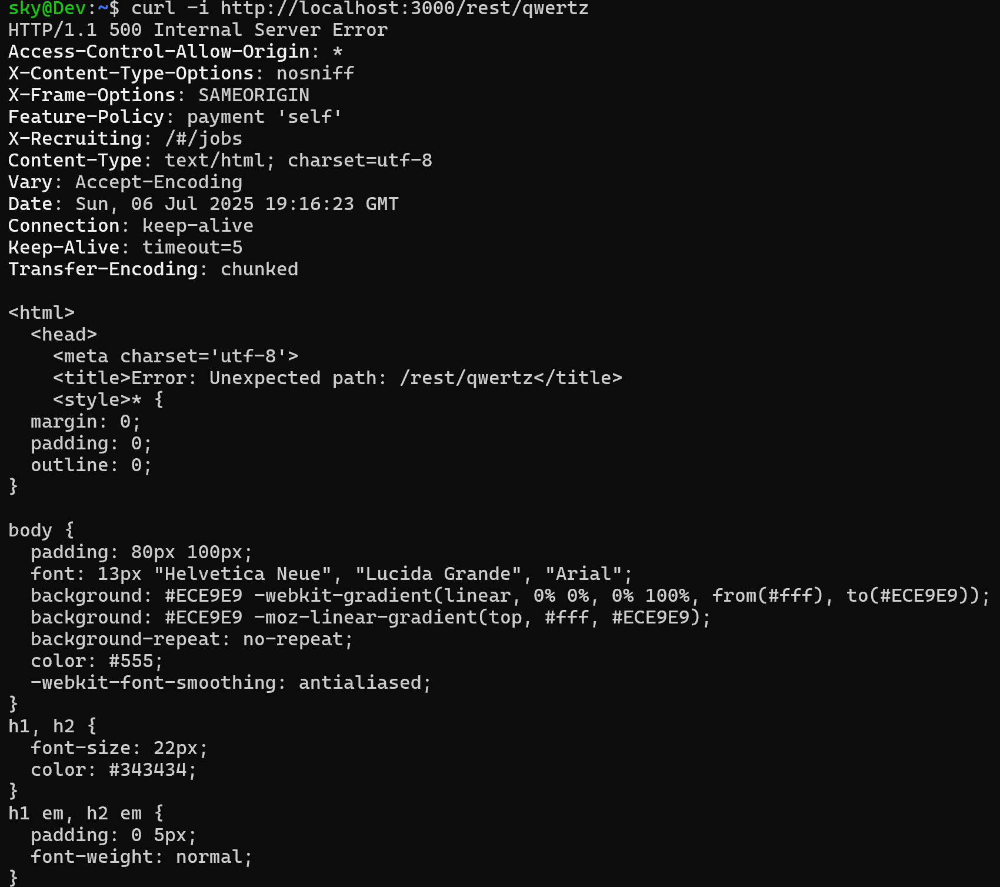
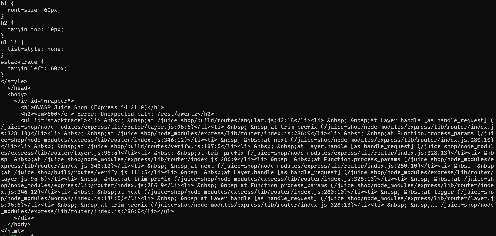
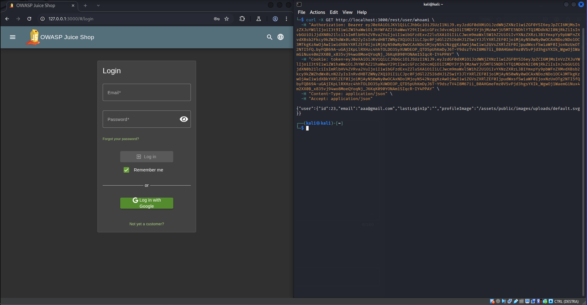
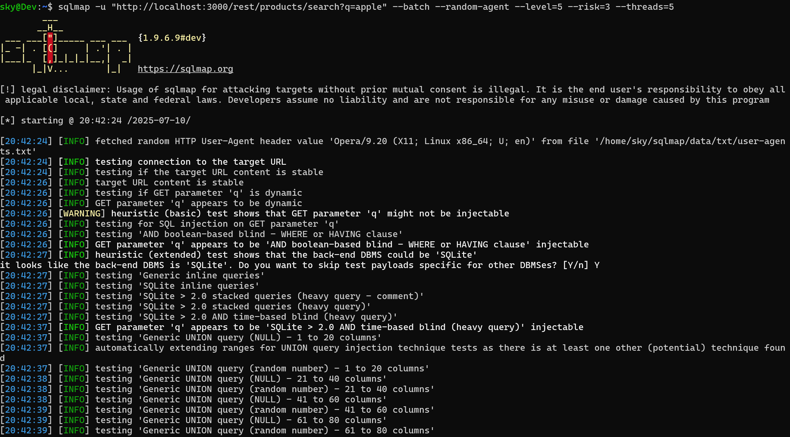
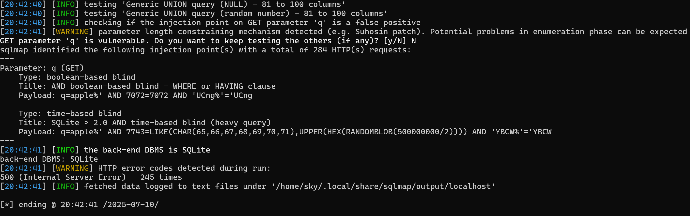

# **Vulnerability assessment**
Vulnerability Assessment completo per il progetto su Juice Shop.

# **1. Accesso alla cartella FTP**
## **Introduzione**
A partire dalla scansione dei path accessibili dal sito web, è stato possibile scoprire il path `FTP` che normalmente è nascosto e protetto dagli accessi indesiderati.

## **Descrizione della vulnerabilità**
Il server espone una cartella accessibile via protocollo FTP senza richiedere autenticazione. Questo espone potenzialmente file sensibili o informazioni critiche a chiunque abbia accesso alla rete, violando i principi di confidenzialità. Per esempio, al suo interno di trovano file come:

* Package.json: che permette di avere una visione completa sull'architettura usata dal server.
* Acquisition.md: file confidenziale interno all'azienda.

## **Riproducibilità**
1. Aprire il browser

2. Connettersi all’indirizzo `http://127.0.0.1:3000/ftp`

3. Accedere liberamente ai file interni

## **Prova della rilevazione**


## **Classificazione OWASP TOP 10**
* **A05:2021 - Security misconfiguration**: il server potrebbe essere stato progettato bene ma l'implementazione e la sua configurazione sono state definite in modo superficiale ed errato.

## **Requisiti dell'attaccante**
1. Per l'accesso alla cartella e ad alcuni dei file è necessario un terminale in grado di effettuare una richiesta al server per il path definito.

2. Conoscenza della presenza della cartella FTP.

## **Gravità e Impatti**
La gravità è alta: dentro la cartella sono presenti chiaramente dei file di tipologia confidenziale e file riguardante la sicurezza dell'applicazione che, se risultassero accessibili a chiunque, comprometterebbero la sicurezza degli utenti.

* Il file `package` contiene dati riguardante l'architettura del sistema.
* Il file `incident-support` potrebbe contenere dati riguardante incidenti di sicurezza.
* Il file `suspicious_erros` potrebbe contenere dati riguardante attività sospette.
* Il file `encrypt e announcement` potrebbe contenere dati confidenziali protetti.   

## **Fix del Codice**
* Disabilitare l'accesso alla cartella FTP

* Imporre un controllo dei permessi d'accesso alla cartella e ai file

* Criptare tutti i file per i quali è richiesta la triade CIA

---

# **2. Accesso ai file diversi da .md e .pdf tramite "Null Byte Injection"**
## **Introduzione**
Dopo aver effettuato l'accesso all'interno della path `FTP`, è stato fatto una ricognizione del path stesso che ha portato al rilevamento di file confidenziali.

Si è provato ad ad accedere ai vari file presenti ma il server presentava un controllo degli accessi ai file tramite estensione, si è cercato di bypassare questo blocco di sicurezza inducendo il server a pensare che si stia accedendo ad un file valido.

## **Descrizione della vulnerabilità**
I file `.md` e `.pdf` sono liberamente accessibili. A prima vista anche gli altri file che hanno una estensione diversa sembrano essere accessbili. 

Il server però implementa una sorta di controllo solo sull'estensione finale del file come è visibile dal messaggio sottostante.


Questa vulnerabilità si basa sul fatto che si invia al server un input particolare costituito da una stringa che contiene `%2500`, per esempio:

`percorso_file.estensione_non_ammessa%2500.md`

`percorso_file.estensione_non_ammessa%2500.pdf`

Il server fa 2 tipi di controlli:

1. Il server verifica solo l'estensione del file richiesto. Se si aggiunge un  `.md`/`.pdf` alla fine del file, il server valida questa richiesta tranquillamente.

2. Il server durante l'accesso al file, leggerà il nome del file da accede ma quando incontra il valore `%2500`, esso viene codificato nel valore `NULL` byte. Il server termina la sua lettura del nome del file quando incontra questo byte di terminazione; se non lo facesse, il nome del file sarebbe invalido.
    - `127.0.0.1:3000/coupon.bak%2500.md` -> `127.0.0.1:3000/coupon.bak` -> file valido e presente
    - `127.0.0.1:3000/coupon.bak.md` -> `127.0.0.1:3000/coupon.bak.md` -> file invalido in quanto non termina per `.md`/`.pdf` oppure, se si riesce a bypassare il primo controllo, quando il server quando ricercherà il file allora non lo troverà.

## **Riproducibilità**
1. Accedere all'url http://127.0.0.1:3000/ftp

2. Inviare una richiesta all’URL senza null byte: http://127.0.0.1:3000/ftp/coupons_2013.md.bak (in questo caso, la richiesta viene rifiutata in base alla policy che consente solo file con estensione .md o .pdf).

3. Inviare la stessa richiesta modificando l’URL per includere il null byte encoded: http://127.0.0.1:3000/ftp/coupons_2013.md.bak%2500.md

4. Dopo la decodifica nel null byte, il sistema interpreta il percorso come coupons_2013.md.bak, bypassando il controllo finale sull’estensione e permettendo l’accesso al file.

## **Prova della rilevazione**


## **Classificazione OWASP TOP 10**
* **A01:2021 - Broken access control**: anche se la cartella è pubblicamente accessibile, il server non esegue nessun controllo sui permessi di coloro che provano ad accedere ai file confidenziali.

## **Requisiti dell'attaccante**
1. Per l'accesso alla cartella e ad alcuni dei file è necessario un terminale in grado di effettuare una richiesta al server per il path definito.

2. Conoscenza della presenza della cartella FTP.

3. Conoscenza del percent-encoding (`%2500` viene decodificato in `%00` ovvoero il byte `NULL`).

## **Gravità e impatti**
La gravità è alta: dentro la cartella sono presenti chiaramente dei file di tipologia confidenziale e file riguardante la sicurezza dell'applicazione che, se risultassero accessibili a chiunque, comprometterebbero la sicurezza degli utenti.

## **Fix del codice**
- Validare e sanificare correttamente tutti i percorsi dei file lato server, rimuovendo o bloccando caratteri di encoding sospetti come %00 e le sue varianti (%2500).

- Implementare controlli di accesso robusti per verificare che l’utente abbia i permessi necessari per accedere a ciascun file richiesto.

---

# **3. SQL injection tramite il login**
## **Introduzione**
Dopo aver constatato che c'è la possibilità di inviare al server degli input utente, in particolare nella pagina di `Login`, ci potrebbe essere la possibilità che il server gestica in modo sbagliato oppure che non gestica affatto gli input che gli arrivino, ovvero non c'è sanificazione e/o validazione dell'input.

## **Descrizione della vulnerabilità**
Inserendo un carattere speciale (es. ') nel campo username della pagina di login, l’applicazione ritorna un messaggio generico [object Object] e, nell’HTTP response body intercettata, compare parte della query SQL. 

Questo indica che i messaggi d’errore del database non sono gestiti correttamente, rivelando dettagli interni dell’implementazione SQL e potenzialmente facilitando un attacco di SQL Injection.

Inoltre, il server non esegue nessun controllo sull'input sia lato frontend sia lato backend per evitare che un utente invii degli input potenzialmente dannosi.

## **Riproducibilità**
1. Navigare nel sito web fino alla pagina di login.
2. Inserire nel campo username il carattere `'` e una password a scelta.
3. Inviare la richiesta di login.
4. Osservare la risposta HTTP (status code, body) e l’errore esposto [object Object].

## **Prova della rilevazione**


## **Classificazione OWASP TOP 10**
- **A03:2021 - Injection**: il server gestisce la richiesta di login, concatenando `email` e `password` con la query SQL. Usando questa vulnerabilità è possibile concatenare un codice SQL arbitrario.

## **Requisiti dell’attaccante**
1. Accesso alla pagina di login.
2. Conoscenze SQL di base per creare una query SQL.

## **Gravità e Impatti**
La gravità è alta: l'errore mostra come viene gestito internamente le query SQL e questo facilità la possibilità di eseguire SQL injection e potenzialmente ottenere tutti i dati collegati al DB SQL.

## **Fix del Codice**
- Parametrizzare tutte le query (prepared statements) invece di concatenare stringhe.

- Validazione e sanitizzazione dei parametri in ingresso (es. whitelist di caratteri).

- Gestire gli errori: non restituire gli erroi al client. Loggare internamente gli errori dettagliati.

---

# **4. Cross-site scripting (XSS) nella barra di ricerca**
## **Introduzione**
Dopo aver constatato che il sito web permette di eseguire delle ricerche sui prodotti, la barra di ricerca viene sottoposta ad indagine per capire se esegue una qualche operazione di sanificazione e validazione degli input, per evitare l'esecuzione di script malevoli indesiderati.

## **Descrizione della vulnerabilità**
La vulnerabilità è un Cross-Site Scripting (XSS) presente nella funzione di ricerca dell'applicazione. Un utente malintenzionato può inserire codice JavaScript dannoso nel campo di ricerca, che viene poi eseguito nel browser della vittima senza adeguata sanitizzazione.

Si è scoperto, inoltre, che l'applicazione web salva il valore del campo di ricerca direttamente nell'url del sito web. Questo può permettere ad un attaccante di inviare un link malevolo all'utente che, se accedesse al sito tramite il link, eseguirebbe involontariamente lo script malevolo.


## **Riproducibilità**
1. Aprire il sito web su una qualsiasi pagina.
2. Eseguire nel tasto di ricerca il seguente codice:
```js
<iframe src="javascript:alert(`Script eseguito`)"></iframe>
```
3. Comparirà un alert con il testo `Script eseguito`.

## **Prova della rilevazione**


## **Classificazione OWASP TOP 10**
* **A03:2021 - Injection**: un malintenzionato è in grado di eseguire del codice malevolo nel browser dell'utente.

## **Requisiti dell'attaccante**
1. Capacità di indurre un utente a interagire con il contenuto vulnerabile, come ad esempio un link contentente del codice malevolo.

## **Gravità e impatto**
La gravità è alta: se un malintenzionato potesse eseguire del codice JS in modo del tutto incontrollato sarebbe in grado, tra le altre cose, di:

1. Furto dell'indentità dell'utente.
2. Manipolazione dell'interfaccia dell'applicazione dell'utente.
3. Esecuzione di qualsiasi script malevolo nel browser utente.

## **Fix del Codice**
* Implementare una corretta sanitizzazione e escaping dell'input utente.
* Evitare di creare link contenente il testo ricercato dall'utente.

# **5. Accesso ai dati del carrello degli altri utenti**
## **Introduzione**
Analizzando il funzionamento dell’API utilizzata per recuperare i dati del carrello dell’utente, si è osservato che essa richiede esclusivamente il basket ID come parametro. Questo significa che, modificando manualmente il basket ID, è possibile tentare di accedere ai dati del carrello di altri utenti.

## **Descrizione della vulnerabilità**
L'applicazione consente di visualizzare i carrelli di altri utenti semplicemente modificando l'ID del carrello nella richiesta. Questa esposizione diretta di un identificatore senza un adeguato controllo degli accessi permette l’accesso non autorizzato a dati sensibili.

## **Riproducibilità**
1. Effettuare il login come utente legittimo.
2. Accedere al carrello personale e modificare l'ID del basket
3. Se il basket id è 5 allora la richiesta è `/rest/bakset/10` allora è possibile modificare semplicente il valore numerico della richiesta GET in qualcosa del tipo `/rest/basket/3`.
4. Inviare la richiesta modificata.
5. L'app risponde con i dati di un altro carrello.

## **Prova della rilevazione**
L'immagine sottostante mostra una richiesta legittima per il carrello utente (`basket ID = 6`)


L'immagine sottostante mostra una richiesta modifica per il carrello di un altro utente (`basket ID = 1`) usando lo stesso account dell'utente precedente.


## **Classificazione OWASP TOP 10**
* **A01:2021 – Broken Access Control**: il server non esegue nessun controllo aggiuntivo sull'identità dell'utente che ha eseguito la richiesta API, esponendo potenziali dati sensibili a tutti coloro che ne fanno richiesta.

## **Requisiti dell'attaccante**
1. L'attaccante deve essere in grado di manipolare le richieste API, per esempio tramite Burp Suite o Postman.

## **Gravità e Impatti**
La gravità è alta. La vulnerabilità permette ad un attaccante di entrare in possesso in modo non autorizzato ai dati degli utenti, violando eventualmente anche il GDPR se in UE.

## **Fix del Codice**
* Implementare controlli lato server per verificare che l’utente autenticato abbia i permessi per accedere alla risorsa richiesta. 

* Evitare l’uso di ID prevedibili quando possibile, o usare identificatori opachi (es. UUID).

--- 

# **6. Utilizzo di un algoritmo di hashing vulnerabile per le password**
## **Introduzione**
Dopo aver osservato che, a seguito del logout, il server restituisce informazioni relative all’account utente, si analizza la struttura dei dati ricevuti per determinare l’algoritmo utilizzato per l’hashing delle password. 

Una volta identificato l’uso dell'algoritmo, si può procedere con un attacco di tipo dizionario o brute-force per ottenere la password in chiaro dell’utente.

## **Descrizione della vulnerabilità**
L'applicazione utilizza l'algoritmo MD5 per hashare le password utente senza l’aggiunta di un salt o di misure di protezione. 

MD5 è un algoritmo obsoleto e vulnerabile ad attacchi basati su dizionario, rainbow table e brute-force. Inoltre, l’assenza di un salt rende possibile precomputare gli hash e riutilizzarli per attaccare facilmente più account che condividano la stessa password.

## **Riproducibilità**
1. Effettuare il login con un account valido.
2. Ispezionare la risposta e identificare la presenza dell’hash della password nel payload JSON.
3. Copiare l’hash trovato e salvarlo in un file di testo (hash.txt).
4. Lanciare un attacco con dizionario usando un tool come john the ripper o hashcat.
5. Aspettare la terminazione dell'attacco per ottenere la password in chiaro.

## **Prova della rilevazione**
1. Prima si ottiene l'hash della password


2. Si esegue l'identificazione del tipo di algoritmo tramite `hashid`.


3. Si usa `John the Ripper` per eseguire un attacco di tipologia dizionario.


## **Classificazione OWASP TOP 10**
- **A02:2021 – Cryptographic Failures**: il server utilizza un algoritmo di hashing vulnerabile `MD5`. In aggiunta, il server non utilizza nessun `salt` quindi è sensibile agli `attacchi a dizionario` oppure tramite `rainbow-table`.

## **Requisiti dell'attaccante**
1. Accesso all'hash della password dell'utente.
2. Dimestichezza con tool di cracking come John the Ripper o Hashcat.
3. Disponibilità di dizionari comuni di password.

## **Gravità e Impatti**
La gravità è alta: il rischio principale è che un attaccante possa ottenere rapidamente la password in chiaro degli utenti, compromettendo account, dati sensibili e potenzialmente la sicurezza dell'intera applicazione. 

Questo comportamento viola le best practice di gestione delle credenziali e può costituire un'infrazione al GDPR in ambienti produttivi reali.

## **Fix del Codice**
- Abbandonare l’uso di algoritmi vulnerabili come MD5 e passare a un algoritmo sicuro come bcrypt, scrypt o Argon2, con annesso salting per evitare di avere lo stesso hash per la stessa password.
- Evitare di esporre qualsiasi hash in client-side tokens o risposte API.

---

# **7. Account Takeover tramite Reset Password con Domanda di Sicurezza**
## **Introduzione**
L’indirizzo email è stato scoperto analizzando i commenti e le recensioni pubblicate sul sito web, dove è visibile in chiaro. Questa semplice esposizione rende possibile un primo contatto con l’account, potenzialmente sfruttabile in attacchi mirati.

## **Descrizione della vulnerabilità**
La funzionalità di reset password si basa su una security question legata all'utente.  
Tuttavia:
- Le domande sono prevedibili (es. "Your eldest sibling’s middle name?")
- Le risposte sono deboli, comuni o recuperabili da informazioni pubbliche
- Nessun meccanismo di rate-limiting o CAPTCHA impedisce un attacco brute-force

## **Riproducibilità**
1. Trovare un utente target. Si individua l’email analizzando i commenti pubblicati sul sito.
2. Visita la pagina di reset password.
```bash
http://localhost:3000/#/forgot-password
```
3. Inserire la mail trovata. (es. `jim@juice-sh.op`)
4. Provare risposte comuni o stupide alla domanda di sicurezza.
5. Se la risposta è giusta, ti fa reimpostare la password. (es. `Samuel`)
→ Inserisci una nuova password
→ Vai su /login e accedi all’account della persona

## **Prova della rilevazione**
1. Risposta alla domanda corretta.


2. Login effettuato.


## **Classificazione OWASP TOP 10**
- **A07:2021 – Identification and Authentication Failures:** sfrutta un meccanismo di autenticazione alternativo (reset password) che non verifica efficacemente l'identità dell'utente.
- **A01:2021 – Broken Access Control:**.

## **Requisiti dell'attaccante**
1. Conoscere/indovinare l’email del target.
2. Indovinare o brute-forzare la risposta alla security question

## **Gravità e Impatti**
La gravità è alta: un attaccante può facilmente ottenere il controllo completo dell’account bersaglio rispondendo correttamente a una domanda di sicurezza prevedibile. Questo permette l’accesso a dati personali e funzionalità riservate, violando le best practice sulla gestione delle credenziali e potenzialmente anche il GDPR in ambienti reali.

## **Fix del Codice**
- Evitare l’uso di security questions come unico meccanismo
- Forzare utenti a usare 2FA o link via email per reset
- Implementare rate-limiting e blocco temporaneo
- Loggare e notificare tentativi falliti di reset

---

# **8. Stack Trace ed Errori Interni**
## **Introduzione**
Durante l’analisi dei file accessibili e delle risposte del server, è stata osservata la presenza di messaggi di errore dettagliati direttamente nelle pagine web, indicando una possibile esposizione non controllata degli errori interni.

## **Descrizione della vulnerabilità**
L’applicazione restituisce messaggi di errore dettagliati e stack trace interni in risposta a input malformati o non gestiti correttamente.  
Questi messaggi rivelano informazioni sensibili sull’architettura e sul codice sorgente, facilitando potenziali attacchi.

## **Riproducibilità**
1. Aprire un terminale o utilizzare uno strumento come Postman.
2. Inviare una richiesta malformata o non valida, ad esempio:
``` bash
curl -i http://localhost:3000/rest/qwertz
```
3. La risposta sarà una pagina HTML contenente un messaggio di errore e lo stack trace.

## **Prova della rilevazione**





## **Classificazione OWASP TOP 10**
- **A06:2021 – Security Misconfiguration**

## **Requisiti dell'attaccante**
- Nessun requisito specifico: vulnerabilità accessibile anche da utente non autenticato.
- È sufficiente inviare una richiesta malformata o a un endpoint non esistente.

## **Gravità e Impatti**
La gravità è media: non consente di compromettere direttamente il sistema, ma facilita attacchi mirati grazie all’esposizione di informazioni sensibili come: Tecnologie e framework utilizzati, Struttura delle cartelle (es. `/build/routes/, /node_modules/`), File e linee di codice potenzialmente vulnerabili (es. `angular.js:42`).

## **Fix del Codice**
- Implementare una gestione centralizzata degli errori tramite un error handler in Express, restituendo messaggi di errore generici all’utente finale.
- Limitare la visualizzazione dello stack trace ai soli log interni del server.

---

# **9. Manipolazione del JWT user token**
## **Introduzione**
L'analisi dello user token ha portato alla luce che il server, come accade nelle maggior parte delle web application, utilizza il JWT token per identificare l'utente senza la necessità per esso di doversi autenticare ad ogni richiesta API.

Il JWT rappresenta però un punto di attacco dell'applicazione in quanto può contenere dati sensibili dell'utente, come id, username, email, password, ecc., e può essere manipolabile, tramite modifica del token stesso, oppure creato in modalità custom se si è in possesso della chiave usata per firmare il token stesso.

## **Descrizione della vulnerabilità**
Il JWT token è vulnerabile alla manipolazione: infatti si può modificare l'algoritmo usato per firmare il token e il ruolo dell'utente e inviare questo token JWT modificato al server. 

Il server infatti si fida dei token che arrivano dal client e non effettua controllo aggiuntivi sull'integrità del web token inviato e questo grazie alla modifica dell'algoritmo inserito nel header del JWT che viene modificato a None.

## **Riproducibilità**
1. Ottenere un token valido tramite login con un account valido.
2. Modificare il JWT token andando a cambiare l'algoritmo utilizzato e il ruolo dell'utente ed eliminando la firma digitale obsoleta.
3. Inviare al server ad ogni richiesta il nuovo token modificato.

## **Prova della rilevazione**
Il server ora riconoscerà il client con il ruolo di admin e permetterà ad esso di accedere alle sezioni dedicate come ad esempio `administration`.


## **Classificazione OWASP TOP 10**
- **A01:2021 – Broken Access Control**: il server si fida dell'input dell'utente senza verificare se l'utente abbia effettivamente i permessi necessari per eseguire azioni da utente privilegiato.

## **Requisiti dell'attaccante**
* Comprensione del funzionamento del JWT token.
* Ottenimento di un JWT valido facendo il login con un account qualsiasi.
* Capacità di decodificare, leggere e manipolare il token.

## **Gravità e Impatti**
La gravità è alta: consente l'escalation di privilegi con il quale un attaccante è in grado di accedere a funzionalità riservate, impersonare altri utenti, potenzialmente accedere ai dati personali di essi, ecc.

## **Fix del Codice**
* Rifiutare tutti i token che hanno `None` come algoritmo oppure che non contengono la firma digitale.
* Validare sempre il token ricreando la firma digitale confrontandola con quella contenuta nel JWT.
* Controllare la validità dei campi del payload anche se la firma digitale è valida quindi il token è integro.

# Assenza di invalidazione del JWT
## Introduzione
Durante l’analisi del comportamento del server rispetto alla gestione dei token JWT, è emerso che il sistema non invalida il token di accesso al momento del logout dell’utente e il token stesso non presenta nessun parametro per definire il tempo di validazione del token (assenza del parametro `exp`).

Questo comportamento permette a un attaccante che abbia sottratto un token valido di continuare a effettuare richieste e accedere a risorse protette anche dopo che l’utente ha terminato la propria sessione. L’assenza di meccanismi di scadenza o revoca automatica rende il token JWT un vettore di accesso persistente al sistema, simulando una sessione utente eterna. 

## Descrizione della vulnerabilità
Il server accetta e considera validi i token JWT anche dopo che l’utente esegue il logout. Non viene eseguito alcun controllo o invalidazione sul token, né viene definita una scadenza (exp) all’interno del payload del JWT.

Questa vulnerabilità consente a un token rubato di essere riutilizzato per un periodo indefinito, facilitando attacchi come la persistenza client-side, session hijacking, replay attack e impersonazione dell’utente.

## Riproducibilità
1. Eseguire login con credenziali valide e ottenere il token JWT dal Local Storage oppure interfeccare/ottenere tramite metodi alternativi il token JWT.
2. Salvare il token in un file.
3. Effettuare logout dall’interfaccia utente se è stato fatto il login.
4. Aspettare un certo periodo di tempo e/o usare il token salvato per eseguire richieste API (es. GET /rest/user/whoami) tramite strumenti come curl o Burp suite.
5. Verificare che il server continui ad accettare il token e restituisca dati utente.

## Prova della rilevazione




## Classificazione OWASP TOP 10
* **A07:2021 – Identification and Authentication Failures**: il sistema non gestisce correttamente la scadenza e revoca dei token, permettendo accessi continuativi anche dopo il logout.

## Requisiti dell'attaccante
* Capacità di ottenere un token JWT valido (es. tramite furto via XSS o MITM).
* Conoscenza dei meccanismi di sessione e della struttura dei token JWT.
* Capacità di inviare richieste API con token manipolati o riutilizzati.

## Gravità e Impatti
La vulnerabilità è alta, in quanto consente accesso continuativo al sistema da parte di attaccanti non autorizzati. Le sessioni non invalidabili possono essere sfruttate per:

* Accedere a dati personali.
* Effettuare operazioni sensibili.
* Mantenere una persistenza dell'accesso in un contesto di post-exploit.

## Fix del Codice
* Aggiungere il campo exp nei token JWT per definirne la scadenza temporale.

* In fase di logout, invalidare il token lato server.

* Verificare la validità temporale (exp) e rigenerare token frequentemente.

* Adottare meccanismi di sessione più sicuri come token a breve durata con refresh.

---

# **10. SQL Injection tramite la ricerca dei prodotti**
## **Introduzione**
Dopo aver osservato la presenza di un parametro `q` nella ricerca prodotti, è sorta l’ipotesi che il server non validi o filtri correttamente i dati ricevuti. Ciò potrebbe consentire l’invio di comandi SQL malevoli, compromettendo la sicurezza del sistema.

## **Descrizione della vulnerabilità**
Inserendo un payload manipolato nel parametro `q`, si è rilevato che l'applicazione restituisce errori interni (HTTP 500) o risposte incoerenti, confermando la presenza di una _SQL Injection_. Gli strumenti automatizzati hanno rilevato che il parametro è vulnerabile sia a _boolean-based blind_ sia a _time-based blind SQLi_.

La mancanza di controllo sull’input lato backend consente a un attaccante remoto di manipolare le query SQL eseguite sul database SQLite sottostante.

## **Riproducibilità**
1. Avviare Juice Shop sul container Docker e accedere a `http://localhost:3000`.
2. Eseguire il comando `sqlmap` seguente:
```bash
sqlmap -u "http://localhost:3000/rest/products/search?q=apple" --level=5 --risk=3 --batch --random-agent
```
3. Attendere il completamento della scansione. Verranno rilevate tecniche di injection supportate e tipologia del database.

## **Prova della rilevazione**
`sqlmap` ha confermato che il parametro `q` è vulnerabile a due tecniche di SQL Injection:

**Boolean-based blind:** la risposta del server cambia in base alla condizione logica inviata, permettendo di inferire informazioni bit per bit.

**Time-based blind:** il server ritarda la risposta in presenza di condizioni vere, confermando l’esecuzione della query SQL malevola anche senza messaggi di errore visibili.

L’output ha mostrato chiaramente che il parametro è iniettabile, specificando il tipo di DBMS (`SQLite`) e riportando i payload utilizzati con successo per eseguire le verifiche.





## **Classificazione OWASP TOP 10**
- **A1:2021 – Broken Access Control:** perché consente accesso a dati non autorizzati.
- **A3:2021 – Injection:** SQL Injection diretta su parametri utente.

## **Requisiti dell'attaccante**
* Accesso alla rete in cui è ospitata l’app (es. `localhost` o Docker bridge).
* Conoscenza basilare di strumenti automatizzati come `sqlmap`.

## **Gravità e Impatti**
La gravità è alta, poiché compromette riservatezza, integrità e disponibilità dell'app. Consente l’accesso non autorizzato ai dati degli utenti, la manipolazione del database e può causare crash o blocchi dell’app tramite payload malevoli.

## **Fix del Codice**
- Uso di query parametrizzate/preparate
- Validazione lato server degli input
- Filtri WAF o protezione middleware per API REST